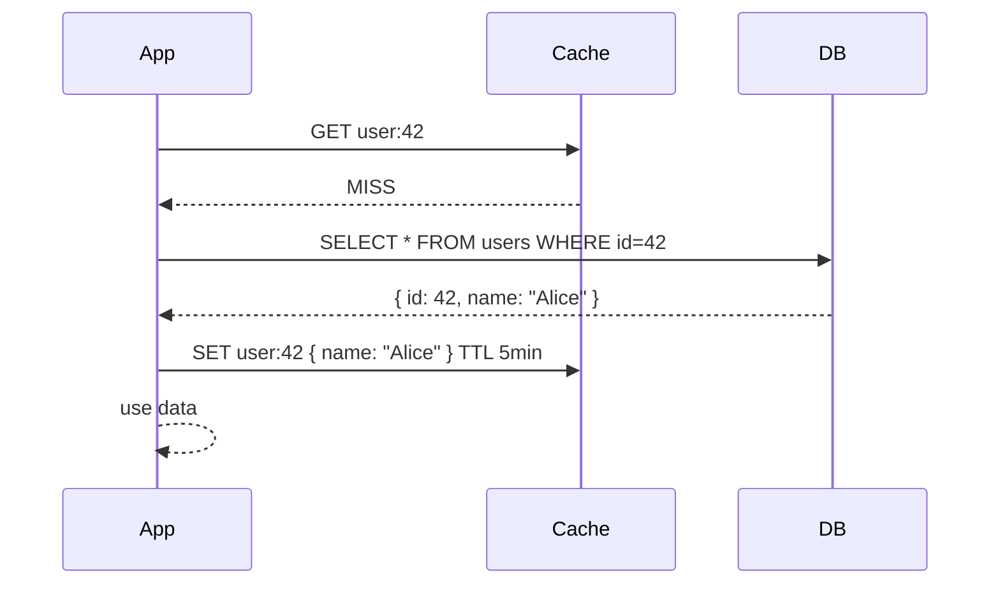
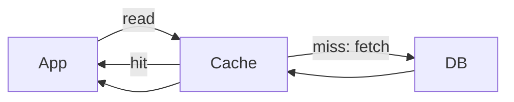
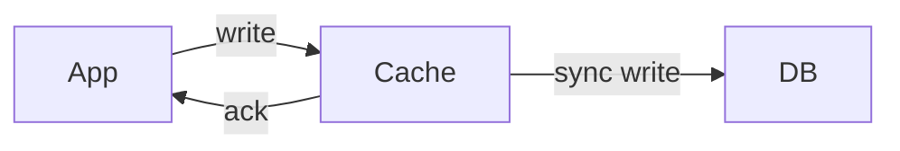
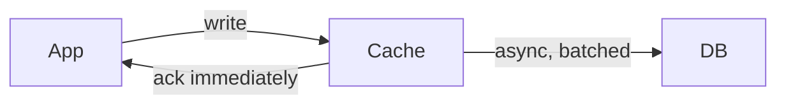
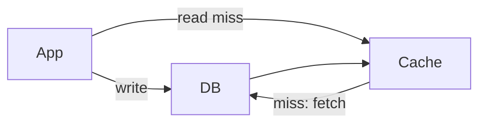
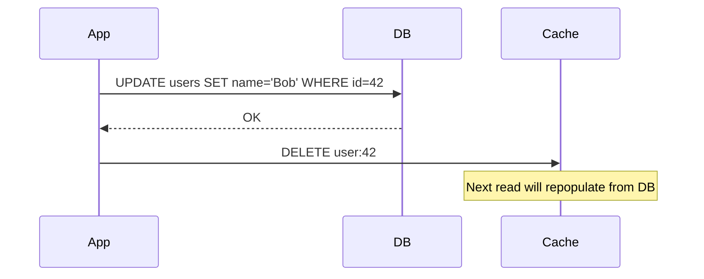
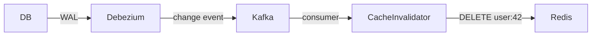
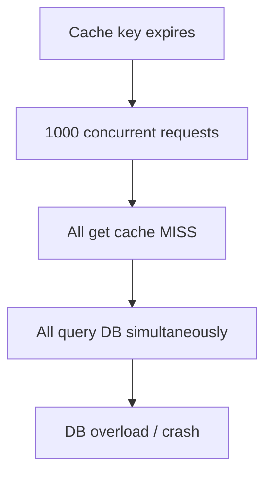

# Caching — Strategies & Invalidation

## What is it?
Storing a copy of data in a faster storage layer (memory) so future reads skip the slower source (DB, API). The two hard problems: **what to cache** and **when to invalidate it**.

---

## Caching Strategies (Write/Read Patterns)

### 1. Cache-Aside (Lazy Loading)
App manages the cache manually. Most common pattern.



- ✅ Cache only what's actually requested
- ✅ Cache failure doesn't break the app (falls back to DB)
- ❌ First request always slow (cache miss)
- ❌ Data can be stale until TTL expires

---

### 2. Read-Through
Cache sits in front of DB. On miss, **cache itself** fetches from DB (not the app).



- ✅ App logic is simpler — always just reads from cache
- ❌ First request still slow
- ❌ Requires cache layer that supports this (e.g. Redis with a loader function)

---

### 3. Write-Through
Every write goes to cache AND DB synchronously.



- ✅ Cache always consistent with DB
- ✅ No stale reads after writes
- ❌ Write latency increases (two writes per operation)
- ❌ Cache fills with data that may never be read

---

### 4. Write-Behind (Write-Back)
Write goes to cache immediately, DB write happens **asynchronously**.



- ✅ Very fast writes
- ✅ Reduces DB write load (batching)
- ❌ Risk of data loss if cache crashes before DB flush
- ❌ Complex to implement correctly

---

### 5. Write-Around
Writes go directly to DB, bypassing cache. Cache is populated only on reads.



- ✅ Good for write-heavy data that's rarely re-read
- ❌ First read after write is always a cache miss

---

## Strategy Cheat Sheet

| Strategy | Read path | Write path | Best for |
|---|---|---|---|
| **Cache-Aside** | App checks cache, falls back to DB | App writes DB, updates cache | General purpose |
| **Read-Through** | Always read from cache | App writes DB | Read-heavy, simple app logic |
| **Write-Through** | Always read from cache | Write cache + DB together | Strong consistency needed |
| **Write-Behind** | Always read from cache | Write cache, async to DB | High write throughput |
| **Write-Around** | App checks cache, falls back to DB | Write directly to DB | Rarely re-read data |

---

## Cache Invalidation Strategies

> *"There are only two hard things in computer science: cache invalidation and naming things."* — Phil Karlton

### 1. TTL (Time-To-Live)
Cache entry expires after a fixed duration. Simplest approach.

```
SET user:42 { ... } EX 300   # expires in 300 seconds
```

- ✅ Simple, automatic
- ❌ Stale window = TTL duration
- ❌ Thundering herd on expiry (many requests miss at once → DB overwhelmed)
  - **Fix:** Add jitter to TTL — `TTL = base + random(0, 30s)`

---

### 2. Event-Based Invalidation
When data changes, explicitly delete or update the cache entry.



- ✅ Cache is fresh immediately after write
- ❌ Must remember to invalidate everywhere data is referenced
- ❌ Distributed systems: what if the DELETE fails?
  - **Fix:** Use short TTL as a safety net alongside event invalidation

---

### 3. Write-Through Invalidation (Update on Write)
Instead of deleting, overwrite the cache entry on every write.

```
App writes → update DB → SET new value in cache
```

- ✅ No stale window
- ❌ Wastes cache space if updated data is never read again

---

### 4. Cache-Aside with Version Key
Append a version number to cache keys. Increment version on update = old keys become orphaned.

```
Cache key: user:42:v3   # v3 is current version
After update: user:42:v4 is the new key — v3 is never read again
```

- ✅ No explicit delete needed — old entries naturally expire via TTL
- ❌ Old versioned keys accumulate until TTL cleans them up

---

### 5. CDC-Based Invalidation
Use Change Data Capture (Debezium → Kafka) to trigger cache invalidation automatically when DB changes.



- ✅ App code doesn't need to handle invalidation
- ✅ Works across multiple services that share the same cache
- ❌ Small lag between DB write and cache invalidation

---

## Eviction Policies

When cache is full, which keys get removed to make space?

| Policy | How it works | Best for |
|---|---|---|
| **LRU (Least Recently Used)** | Evict the key not accessed for the longest time | General purpose — most common default |
| **LFU (Least Frequently Used)** | Evict the key accessed least often overall | Workloads with clear hot/cold access patterns |
| **TTL-based** | Evict keys when their time-to-live expires | When freshness matters more than access pattern |
| **FIFO** | Evict oldest inserted key regardless of access | Simple queues; rarely used in practice |
| **Random** | Evict a random key | Low overhead; surprisingly effective at scale |
| **No eviction** | Return error on write when full | When data loss is unacceptable (e.g. session store) |

### LRU vs LFU — When to pick which

```
LRU is better when:               LFU is better when:
- Recent = relevant               - Frequency = relevance
- News feed, session data         - Product catalog, media assets
- Access patterns shift over time - Stable hot items (top 100 products)
```

> **Gotcha:** LFU can get "stuck" — an item accessed 1000x last week but never since will still rank highly. Fix with **decay** (reduce counts over time).

---

## The Thundering Herd Problem

When a popular cache key expires, thousands of requests hit the DB simultaneously.



**Solutions:**
| Fix | How |
|---|---|
| **TTL Jitter** | Randomize expiry: `TTL = 300 + rand(0,60)` |
| **Mutex / Lock** | Only one request rebuilds cache; others wait |
| **Probabilistic Early Expiry** | Recompute cache slightly before expiry while still serving stale |
| **Background refresh** | Async job refreshes cache before TTL hits |

---

## Interview Talking Points
- **Cache-Aside** is the default answer — simple, resilient, widely used
- **Write-Through** when you can't tolerate stale reads
- **Write-Behind** when write throughput is the bottleneck — but flag the durability risk
- TTL alone is not enough — combine with **event-based invalidation** for critical data
- Always mention **thundering herd** and TTL jitter — shows depth
- CDC-based invalidation is the cleanest for microservices — no app-level coupling
- Cache is **not a source of truth** — always have a fallback to DB
