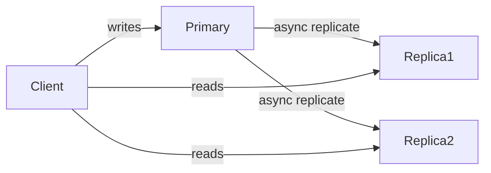
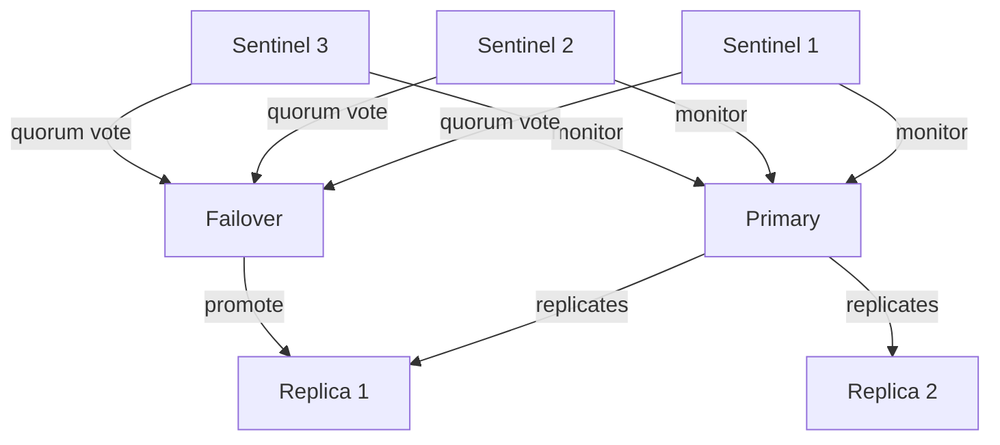
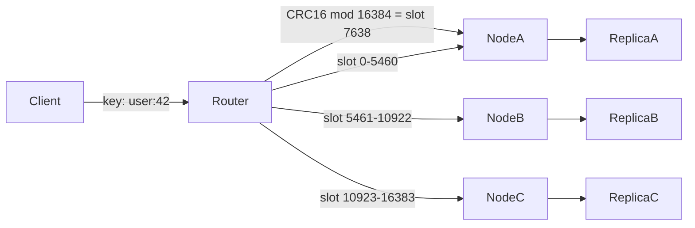

# Redis vs Memcached — Internals & Comparison

## TL;DR
Both are in-memory caches. Memcached is simpler and faster for pure caching. Redis is a full data structure server — richer, more durable, and more versatile. In practice, **Redis has largely replaced Memcached** in modern systems.

---

## High-Level Comparison

| | Redis | Memcached |
|---|---|---|
| **Data structures** | Strings, Hashes, Lists, Sets, Sorted Sets, Streams, HyperLogLog | Strings (blobs) only |
| **Persistence** | RDB snapshots + AOF log | ❌ None — purely in-memory |
| **Replication** | Primary-Replica + Sentinel + Cluster | Basic replication only |
| **Clustering** | Redis Cluster (built-in sharding) | Client-side sharding only |
| **Pub/Sub** | ✅ | ❌ |
| **Lua scripting** | ✅ | ❌ |
| **Transactions** | ✅ (MULTI/EXEC) | ❌ |
| **Threading** | Single-threaded (I/O + commands) | Multi-threaded |
| **Memory efficiency** | Slightly higher overhead | Slightly more memory efficient for plain strings |

---

## Redis Internals

### Memory Model — How Redis Stores Data

Redis is essentially a **giant hash table** in memory mapping keys to values.

```
Global Hash Table (dict)
  ┌──────────────────────────────────────┐
  │  "user:42"  →  Hash object           │
  │  "counter"  →  Integer (encoded)     │
  │  "leaderboard" → Sorted Set (zset)   │
  │  "feed:99"  →  List                  │
  └──────────────────────────────────────┘
```

Every value is a **Redis Object (robj)**:
```c
typedef struct redisObject {
    unsigned type;       // STRING, LIST, SET, ZSET, HASH
    unsigned encoding;   // how it's stored internally (see below)
    void *ptr;           // pointer to actual data
    int refcount;
    unsigned lru;        // for LRU eviction tracking
} robj;
```

### Encoding Optimizations (This is the clever part)
Redis uses **different internal encodings** depending on data size — small objects use compact formats, large ones switch to full structures.

| Data Type | Small (compact) | Large (full) |
|---|---|---|
| String | `int` (if integer) or `embstr` (≤44 bytes) | `raw` (SDS — dynamic string) |
| Hash | `listpack` (≤128 fields) | `hashtable` |
| List | `listpack` (≤128 elements) | `quicklist` (linked list of listpacks) |
| Set | `listpack` or `intset` | `hashtable` |
| Sorted Set | `listpack` (≤128 members) | `skiplist + hashtable` |

> **Interview gold:** "Redis uses a listpack for small sorted sets but switches to a skip list + hash table combo once it grows — the skip list gives O(log n) range queries while the hash table gives O(1) score lookups by member."

### Why a Skip List for Sorted Sets?
A sorted set needs:
- O(1) score lookup by member → **hash table**
- O(log n) rank/range queries (ZRANGE, ZRANK) → **skip list**

A skip list is a probabilistic layered linked list:
```
Level 3: 1 ────────────────────── 50 ──────── 100
Level 2: 1 ──────── 20 ─────────  50 ──────── 100
Level 1: 1 ── 10 ── 20 ── 30 ──── 50 ── 70 ── 100
```
- Skip layers let you jump ahead — O(log n) average for search/insert
- Simpler to implement than a balanced BST (AVL/Red-Black)
- Redis chose it over a B-Tree because it's easier to do lock-free operations on

### SDS — Simple Dynamic String
Redis doesn't use C strings (`char*`). It uses its own **SDS (Simple Dynamic String)**:
```c
struct sdshdr {
    int len;      // current length — O(1) strlen
    int free;     // unused allocated space
    char buf[];   // actual bytes
};
```
- O(1) length — no scanning for null terminator
- Pre-allocates space to avoid realloc on every append
- Binary safe — can store anything including null bytes

---

## Redis Persistence

### RDB (Redis Database Snapshot)
Forks the process and writes a point-in-time snapshot to disk.
```
Every 900s if ≥1 key changed  → save
Every 300s if ≥10 keys changed → save
Every 60s  if ≥10000 changed  → save
```
- ✅ Compact file, fast restarts
- ❌ You can lose up to N minutes of data

### AOF (Append-Only File)
Logs every write command. On restart, replays the log.
```
SET user:42 "Alice"   → appended to aof file
INCR counter          → appended
DEL session:xyz       → appended
```
- ✅ Much less data loss (fsync every second = max 1s loss)
- ❌ Larger files, slower restarts

### Hybrid (recommended)
RDB for fast restarts + AOF for durability. Redis 4.0+ supports a combined format.

---

## Redis Distributed Architecture

### 1. Primary-Replica Replication

- Replicas are **read-only**
- Replication is async → small lag possible

### 2. Redis Sentinel (HA)
Sentinel monitors primary. If primary dies, promotes a replica automatically.

- Needs **quorum** (majority of sentinels agree) before failover
- Clients connect to Sentinel first to discover current primary

### 3. Redis Cluster (Sharding)
Data is split across nodes using **hash slots**. There are **16384 total slots**.

```
Key → CRC16(key) % 16384 → slot number → assigned node
```



- Each node owns a **range of hash slots**
- Each node has its own replica for HA
- Clients get redirected with `MOVED` response if they hit the wrong node
- Adding a node = **rebalance slots** (move slots + their keys)

> **Interview insight:** Redis Cluster uses **hash slots not consistent hashing** — this is intentional. Fixed 16384 slots make rebalancing predictable. Consistent hashing (used by Memcached) minimizes key movement but is harder to reason about.

---

## Memcached Internals

### Memory Model — Slab Allocator
Memcached pre-allocates memory in **slabs** of fixed-size chunks. This avoids memory fragmentation.

```
Slab Class 1: chunks of 96 bytes   [chunk][chunk][chunk]...
Slab Class 2: chunks of 120 bytes  [chunk][chunk][chunk]...
Slab Class 3: chunks of 152 bytes  [chunk][chunk]...
...
Slab Class N: chunks of 1MB        [chunk]...
```

When you store a value:
1. Memcached finds the slab class whose chunk size fits the value
2. Allocates a chunk from that slab
3. Stores the value there

- ✅ No malloc/free per item — very fast allocation
- ❌ Internal fragmentation — a 97-byte value wastes space in a 120-byte chunk
- ❌ Slab imbalance — if your workload shifts, some slabs are full while others are empty

### How Memcached Distributes Keys
Memcached has **no built-in clustering**. Sharding is done **client-side**:

```
Client Library
  key → consistent hashing → which server?
  
  Server 1: 192.168.1.1:11211
  Server 2: 192.168.1.2:11211
  Server 3: 192.168.1.3:11211
```

Uses **consistent hashing** with a virtual node ring:
```
         Server1(v1)
        /
Ring:  0 ──── Server2(v1) ──── Server1(v2) ──── Server3(v1) ──── 360
                                                       \
                                                    Server2(v2)
```
- Each server has multiple **virtual nodes** on the ring
- Key hashes to a point on the ring → routes to the next clockwise server
- Adding a server → only keys between it and its predecessor move
- ✅ Minimizes key redistribution on topology change
- ❌ All logic lives in the client — different clients must agree on the ring

---

## Eviction Policies (Both)

When memory is full, which keys get evicted?

| Policy | Behavior |
|---|---|
| `noeviction` | Return error on write (Redis default) |
| `allkeys-lru` | Evict least recently used key from all keys |
| `volatile-lru` | Evict LRU key only from keys with TTL set |
| `allkeys-lfu` | Evict least frequently used (Redis 4.0+) |
| `volatile-ttl` | Evict key with shortest TTL |
| `allkeys-random` | Evict random key |

### How Redis Approximates LRU
True LRU requires a doubly-linked list of all keys — too much memory. Redis uses **sampled LRU**:
- On eviction, sample N random keys (default 5)
- Evict the one with the oldest `lru` timestamp in the robj
- Redis 3.0+ uses an **eviction pool** of 16 candidates for better accuracy

> **Interview insight:** Redis LRU is approximate, not exact — but it's tunable and memory-efficient. Mention this to show you know the tradeoff.

---

## Failure Modes & Mitigations

| Failure | Impact | Mitigation |
|---|---|---|
| **Primary node crashes** | Writes fail; reads degrade | Redis Sentinel auto-promotes replica; use `min-replicas-to-write` to prevent dirty writes |
| **Replica lag** | Stale reads from replica | Use `WAIT` command for sync replication on critical writes; or read from primary |
| **Cache stampede / thundering herd** | DB overwhelmed on mass expiry | TTL jitter + mutex lock + background refresh (covered in caching doc) |
| **Memory full** | Evictions or write errors | Set eviction policy (`allkeys-lru`); monitor memory; scale vertically or add cluster nodes |
| **Redis Cluster split** | Some hash slots unavailable | Cluster requires majority of masters alive; use `cluster-require-full-coverage no` to serve partial data |
| **AOF corruption** | Can't replay log on restart | Use `redis-check-aof --fix`; fall back to RDB snapshot; accept small data loss window |
| **Memcached node loss** | Keys on that node are gone — no persistence | Re-warm cache from DB; consistent hashing minimizes keys affected |

---

## When to Use Which

| Use Redis when… | Use Memcached when… |
|---|---|
| You need data structures (sorted sets, lists) | Pure string key-value caching only |
| You need persistence / durability | Simplicity and raw throughput matter most |
| You need pub/sub or streams | Multi-threaded performance on many cores |
| You need Lua scripting or transactions | Memory efficiency for large plain blobs |
| You need cluster-level HA | Legacy system already using it |

---

## Interview Talking Points
- Redis global hash table → robj → encoding optimization (listpack → skip list transition)
- Skip list chosen over BST for sorted sets — simpler, lock-friendly, O(log n) range
- SDS vs C strings — O(1) length, binary safe, pre-allocated
- Redis Cluster uses **hash slots** (not consistent hashing) — 16384 slots, CRC16
- Memcached uses **slab allocator** — avoids fragmentation, but causes slab imbalance
- Memcached sharding is **client-side consistent hashing** — no server-side awareness
- Redis LRU is **sampled approximation** — mention the tradeoff
- AOF + RDB hybrid for durability — "I'd use AOF for recovery guarantees with RDB for fast restarts"
