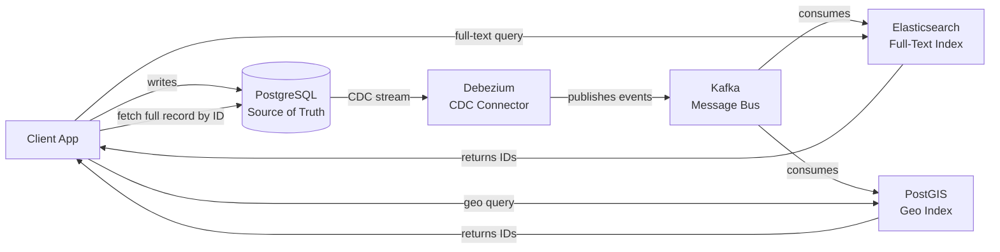
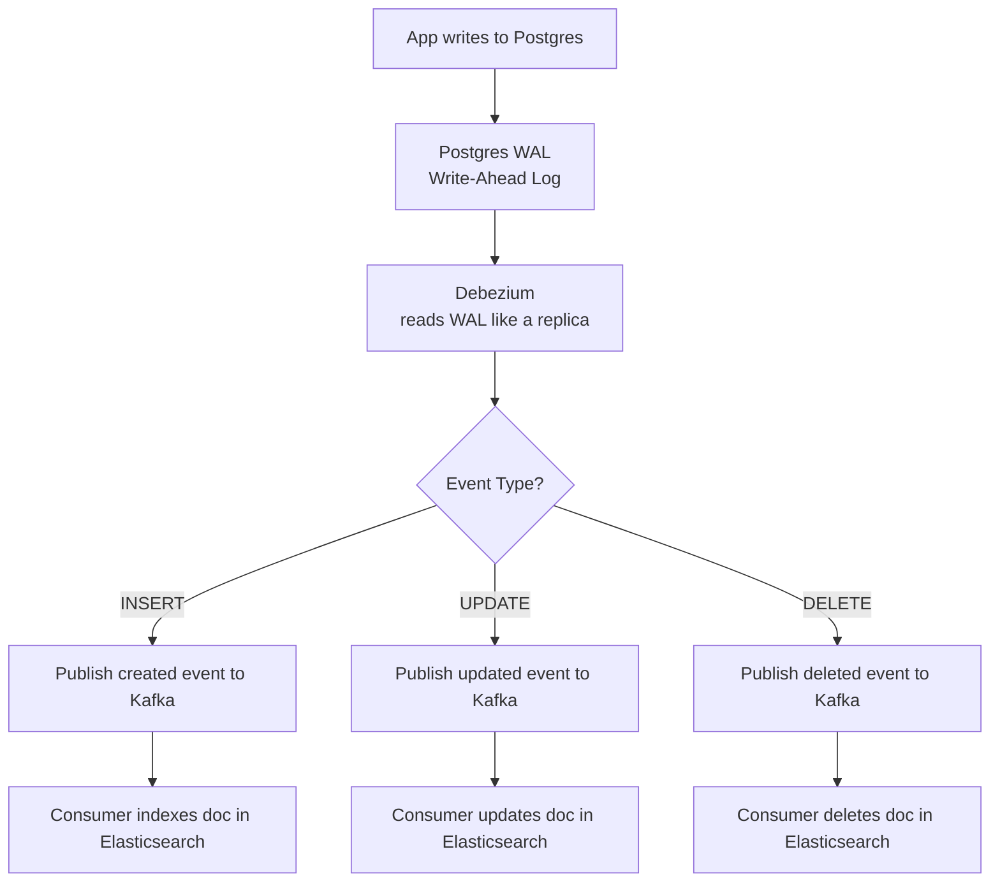
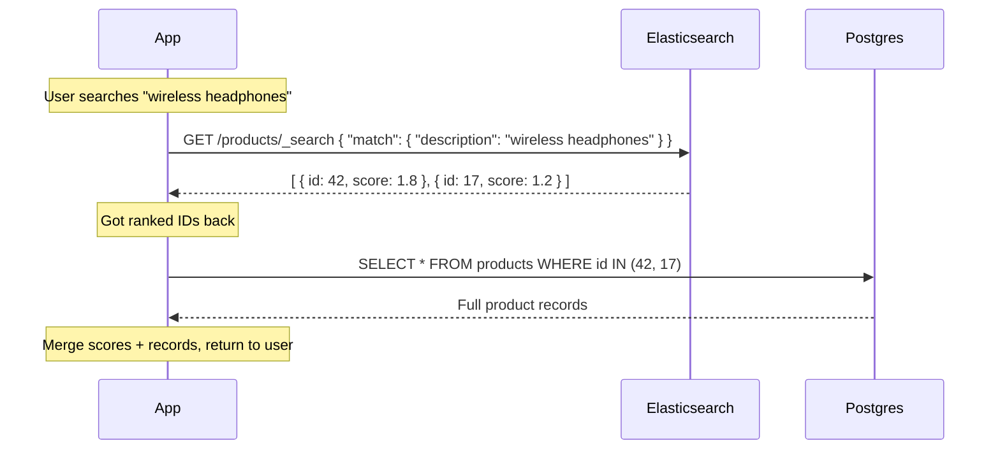
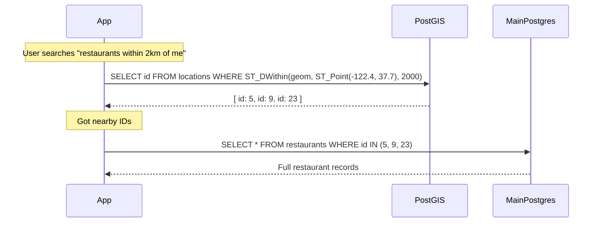
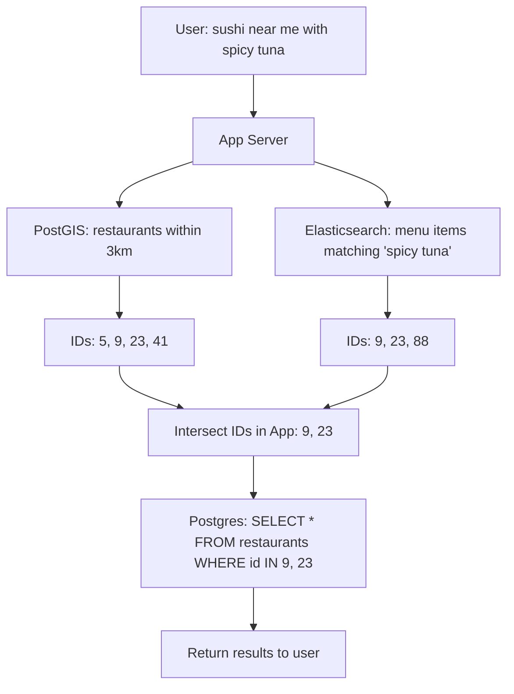

# Database Indexing — External Indexes

## Quick Recap: Why External Indexes?

Postgres is a great general-purpose DB but its built-in indexes hit limits:

| Need | Postgres Built-in | Problem | Better Tool |
|---|---|---|---|
| Full-text search | `tsvector` + `GIN` index | No fuzzy match, no relevance scoring, slow at scale | **Elasticsearch** |
| Geospatial queries | `PostGIS` extension | Fine for simple queries, but complex geo at scale is slow | **PostGIS** (still Postgres, but a dedicated instance) |

> The pattern is always the same: **Postgres = source of truth. External index = optimized read layer.**

---

## The Core Architecture Pattern

**Key insight:** External indexes return **IDs only** — your app then fetches the full record from Postgres using those IDs.

---

## How CDC Works (The Plumbing)

Postgres writes every insert/update/delete to a **Write-Ahead Log (WAL)** — this is how it guarantees durability. CDC tools like **Debezium** tap into this log.

- Debezium acts like a **Postgres replica** — it reads the WAL without touching your main DB queries
- Events flow through **Kafka** so multiple consumers (ES, PostGIS, Redis, etc.) can independently consume them
- If a consumer goes down, it **replays from Kafka offset** — no data loss

---

## Full-Text Search Flow (Elasticsearch)

**Why not just use Postgres full-text?**
- Postgres `tsvector` can't do **fuzzy matching** (typos)
- No **relevance ranking** (BM25 scoring)
- Performance degrades on large tables
- No **aggregations** for faceted search (filter by brand, price range simultaneously)

---

## Geospatial Flow (PostGIS)

PostGIS is a **Postgres extension** — it adds geo data types and spatial indexes (R-Tree / GiST index) to Postgres. For complex geo workloads, you run it as a **dedicated Postgres instance** separate from your main OLTP DB.

**PostGIS key functions:**
- `ST_DWithin` — within X meters
- `ST_Distance` — distance between two points
- `ST_Within` — point inside a polygon (e.g. delivery zone)
- `ST_Intersects` — two shapes overlap

---

## Putting It All Together — Combined Query Example

Imagine a food delivery app: *"Find sushi restaurants near me with 'spicy tuna' on the menu"*

The app runs **both queries in parallel**, intersects the ID sets, then does one final Postgres lookup.

---

## Sync Strategies Compared

| Strategy | How | Pro | Con |
|---|---|---|---|
| **CDC (Debezium + Kafka)** | Tap Postgres WAL | Reliable, no app changes, replayable | Infra overhead |
| **Dual Write** | App writes to Postgres AND ES | Simple | Risk of partial failure (one write succeeds, other fails) |
| **Polling** | Cron job reads `updated_at > last_run` | Simple | Delay, misses deletes, DB load |
| **Outbox Pattern** | App writes to Postgres + outbox table; CDC picks up outbox | Transactionally safe dual-write | Slightly more complex schema |

> **Best practice:** CDC + Kafka for production. Outbox pattern if you can't use CDC directly.

---

## Interview Talking Points
- External indexes are **read optimizations** — Postgres stays the source of truth
- CDC taps the **WAL** — zero impact on your main DB performance
- Queries return **IDs**, not full records — always do a final Postgres lookup
- For combined queries (geo + text), run in **parallel** and intersect results in the app layer
- **Outbox pattern** solves dual-write consistency — worth mentioning
- PostGIS uses **GiST index** (R-Tree variant) — designed for spatial range queries
- Elasticsearch uses **inverted index** — designed for term lookups
