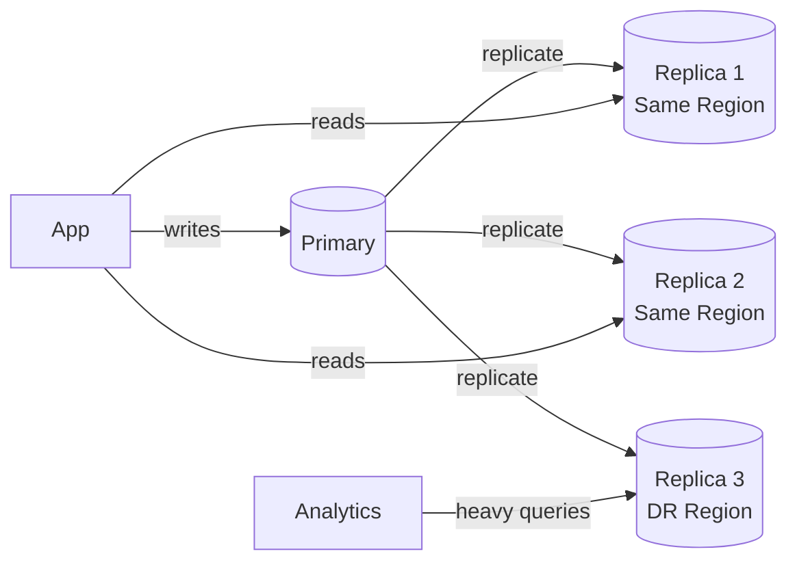
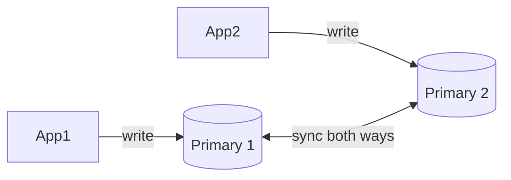
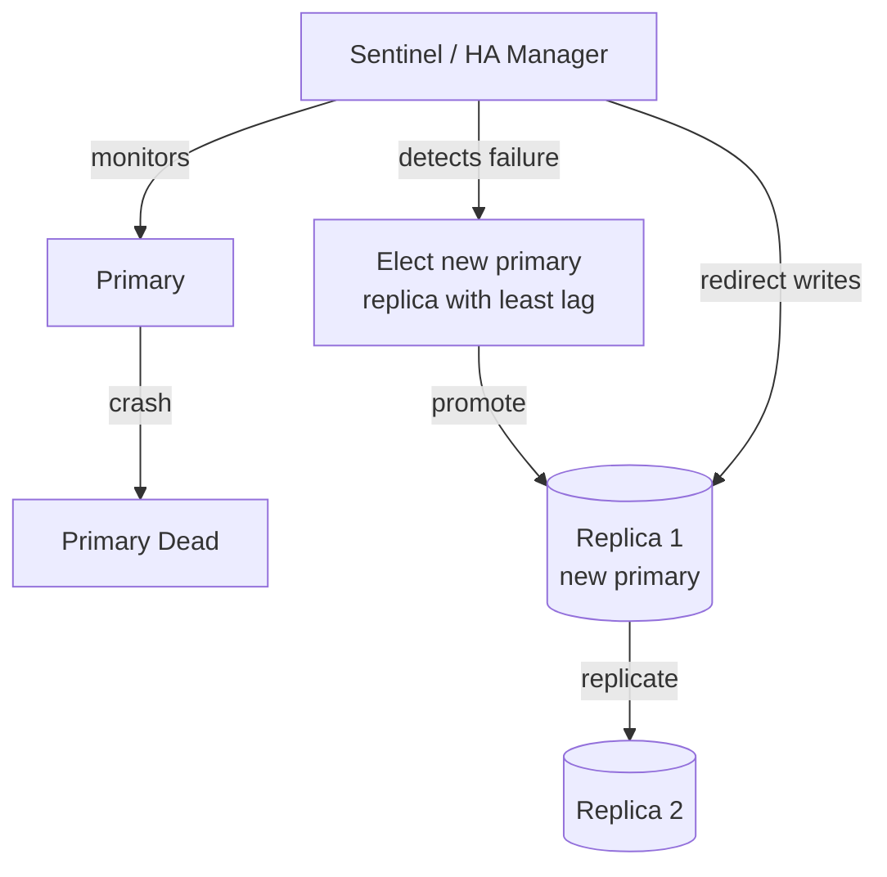

# Database Replication

## What is it?
Maintaining copies of your database on multiple nodes. Primary goal: **high availability and read scaling**. It is almost always the **first scaling step** before considering sharding.

---

## When to Replicate

Use this as a checklist — replication is the right move when:

| Signal | Why Replication Helps |
|---|---|
| **Read traffic overwhelming primary** | Offload reads to replicas |
| **Need zero-downtime on primary failure** | Replica promoted to primary automatically |
| **Need disaster recovery** | Replica in a different region/AZ |
| **Need reporting/analytics without impacting prod** | Point analytics queries at replica |
| **Single DB is a SPOF** | Replication gives you failover capability |

> **Rule of thumb:** Replicate before you shard. Replication is operationally simple. Sharding is not.

---

## Replication Types

### 1. Primary-Replica (Master-Slave)
One primary handles all writes. Replicas handle reads.



- ✅ Simple mental model — one source of truth
- ❌ Primary is still the write bottleneck
- ❌ Replication lag — replicas may be slightly behind

---

### 2. Synchronous vs Asynchronous Replication

| | Synchronous | Asynchronous |
|---|---|---|
| **How** | Primary waits for replica ACK before confirming write | Primary confirms write immediately; replica catches up later |
| **Data safety** | No data loss on primary crash | Can lose last N writes on failover |
| **Write latency** | Higher (waits for replica) | Lower (fire and forget) |
| **Use when** | Financial data, critical records | General web apps, high-throughput writes |

> **Semi-sync (best of both):** Primary waits for ACK from **at least one** replica. Used by MySQL semi-sync replication.

---

### 3. Multi-Primary (Multi-Master)
Multiple nodes accept writes. Conflict resolution required.



- ✅ No single write bottleneck
- ✅ Geo-distributed writes (write to nearest region)
- ❌ **Conflict resolution is hard** — what if both primaries update the same row?
- ❌ Operational complexity
- **Use when:** multi-region active-active setups (rare, high complexity)

---

## Replication Lag — The Key Challenge

Async replication means replicas are always slightly behind. This causes:

```
User writes profile update → goes to primary
User immediately reads profile → goes to replica
Replica hasn't caught up yet → user sees old data 😤
```

### Mitigations
| Approach | How |
|---|---|
| **Read-your-writes consistency** | After a write, route that user's reads to primary for a short window |
| **Sticky reads** | Pin a user's reads to the same replica; at least consistent within a session |
| **Monitor lag** | Alert if replication lag > threshold (e.g. > 1s) |
| **Sync replication for critical paths** | Payment confirmation → always read from primary |

---

## Failover — How it Works



- **Automatic failover** — Sentinel (Redis), Patroni (Postgres), RDS Multi-AZ (AWS)
- **RPO (Recovery Point Objective)** — how much data can you lose? Sync replication = 0. Async = seconds of data.
- **RTO (Recovery Time Objective)** — how fast can you recover? Typically 30–60s for automated failover.

---

## Products with Replication Out of the Box

| Product | Replication Type | Notes |
|---|---|---|
| **AWS RDS Multi-AZ** | Synchronous standby | Auto failover ~60s; same region |
| **AWS Aurora** | Shared storage + up to 15 read replicas | Near-zero replication lag; Aurora Global for cross-region |
| **Google Cloud Spanner** | Synchronous multi-region | Strongest consistency globally |
| **PlanetScale** | MySQL-compatible; branching model | Vitess under the hood |
| **Postgres + Patroni** | Async/sync configurable | Open source HA manager |
| **MongoDB Atlas** | Replica sets (3 nodes default) | Automatic election on failure |
| **CockroachDB** | Multi-region synchronous | Postgres-compatible; built-in geo replication |

---

## Failure Modes & Mitigations

| Failure | Impact | Mitigation |
|---|---|---|
| **Primary crashes** | Writes fail until failover completes | Auto-failover with Patroni/Sentinel; keep RTO < 60s |
| **Replica lag spikes** | Stale reads | Monitor lag; route critical reads to primary |
| **Split brain** (both nodes think they're primary) | Conflicting writes, data corruption | Fencing tokens; STONITH (shoot the other node); quorum-based election |
| **Failover promotes lagging replica** | Data loss (async replication gap) | Use semi-sync; track replication lag before promotion |
| **Cascading replica failure** | No read capacity | Always maintain at least 2 replicas; multi-AZ deployment |

---

## Interview Talking Points
- Replication is about **HA and read scaling** — not write scaling
- Always mention **replication lag** and how to handle read-your-writes consistency
- **Split brain** is the scariest failure — mention quorum/fencing
- RPO vs RTO — shows you think operationally
- "I'd start with a read replica before reaching for sharding"
