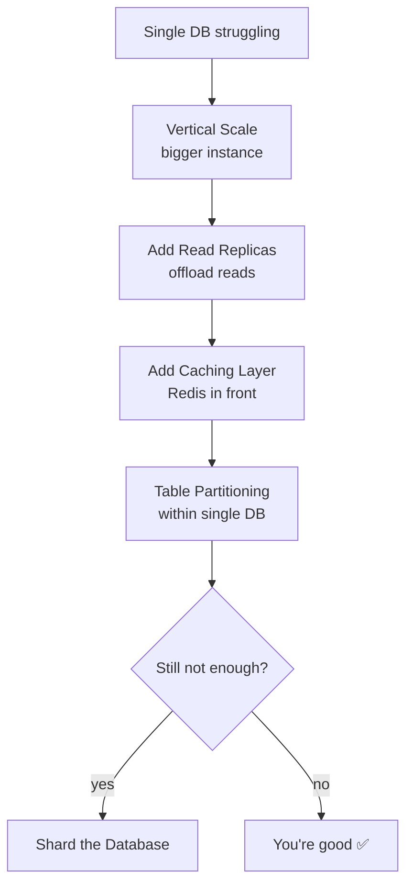
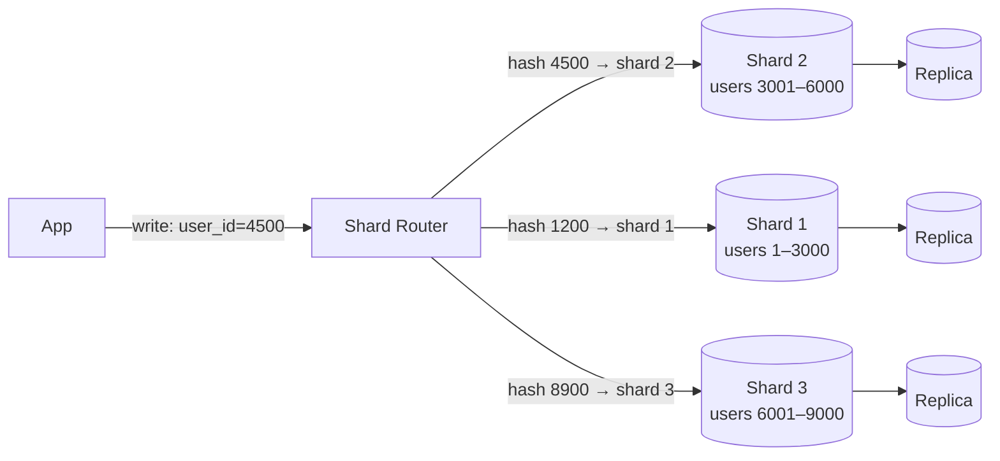
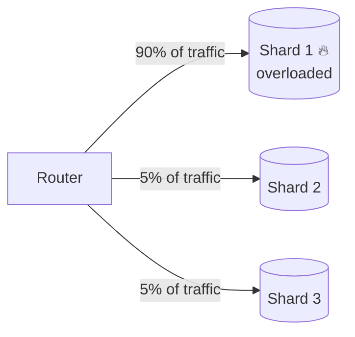
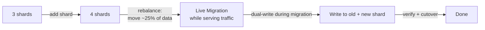

# Database Sharding

## What is it?
Splitting your dataset horizontally across multiple independent DB instances (shards), each owning a subset of the data. Unlike replication (copies of the same data), sharding means **each shard has different data**.

---

## When to Shard — The Scaling Journey

Sharding is a **last resort**. Exhaust these options first:



**Shard when you hit:**
- Write throughput that a single primary can't handle
- Dataset too large for one machine's storage
- Single-node query latency degrading despite all other optimizations
- Need for geographic data isolation (compliance, latency)

---

## How Sharding Works



Each shard is a **fully independent DB** with its own primary + replicas.

---

## Sharding Strategies

### 1. Hash Sharding
```
shard = hash(partition_key) % number_of_shards
```
- ✅ Even data distribution
- ❌ Adding shards requires rehashing — expensive rebalance
- ❌ Range queries span multiple shards
- **Use when:** write distribution is the priority; no range queries

### 2. Range Sharding
```
user_id 1–1M     → Shard 1
user_id 1M–2M    → Shard 2
user_id 2M–3M    → Shard 3
```
- ✅ Range queries stay on one shard
- ❌ Hot shards if data not evenly distributed (e.g. new users all go to last shard)
- **Use when:** time-series data, sequential IDs with range query patterns

### 3. Directory Sharding
A lookup table maps each key to a shard.
```
user_id 42 → Shard 3  (stored in routing table)
user_id 99 → Shard 1
```
- ✅ Most flexible — move keys between shards freely
- ❌ Routing table is a **SPOF and bottleneck** — must be highly available
- **Use when:** need fine-grained control over data placement

### 4. Geo Sharding
```
US users     → Shard in us-east-1
EU users     → Shard in eu-west-1
APAC users   → Shard in ap-southeast-1
```
- ✅ Data locality — low latency for users
- ✅ Compliance (GDPR — EU data stays in EU)
- ❌ Cross-region queries are expensive
- **Use when:** global apps with regional compliance requirements

---

## Choosing a Shard Key — Most Critical Decision

A bad shard key causes **hot shards** (one shard gets all the traffic).

| Shard Key | Problem |
|---|---|
| `created_at` (timestamp) | All new writes go to latest shard — hotspot |
| `user_id` (low cardinality) | Small number of power users overload their shard |
| `country` | US shard gets 10x traffic of others |

**Good shard key properties:**
- **High cardinality** — many possible values
- **Even distribution** — traffic spread uniformly
- **Query alignment** — most queries filter by this key (avoids cross-shard queries)
- **Immutable** — never changes after record creation (changing it means moving the record)

---

## The Hotspot Problem



**Fix:** Add a random suffix to the shard key for high-traffic entities:
```
celebrity_user_id + random(1..10) → spreads writes across 10 virtual shards
Reads must query all 10 and merge → scatter-gather
```

---

## Cross-Shard Queries — The Hard Problem

```sql
-- This is easy on a single DB:
SELECT * FROM orders WHERE amount > 100 ORDER BY created_at

-- On sharded DB: must query ALL shards and merge results in app layer
-- Expensive, slow, hard to paginate
```

**Strategies:**
- **Denormalize** — store data needed for queries on the same shard (co-locate)
- **Fan-out** — query all shards in parallel, merge results in app
- **Secondary index service** — maintain a global index (e.g. Elasticsearch) for cross-shard queries
- **Avoid it** — design shard key so 95%+ of queries stay on one shard

---

## Resharding — When You Need More Shards

Adding a new shard requires moving data. This is painful:



- **Consistent hashing** minimizes data movement on resharding (only 1/N keys move)
- Some systems (Vitess, Citus) automate resharding
- Always do resharding with **dual-write + backfill** — never a hard cutover

---

## Products with Sharding Out of the Box

| Product | Type | Notes |
|---|---|---|
| **Vitess** | MySQL sharding layer | Powers YouTube; automatic resharding; used by PlanetScale |
| **Citus** | Postgres sharding extension | Distributed Postgres; used by Azure Cosmos DB for Postgres |
| **MongoDB Atlas** | Native sharding | Built-in shard key selection and balancer |
| **Cassandra** | Native (consistent hashing) | Masterless; automatic data distribution |
| **DynamoDB** | Fully managed sharding | Invisible to user; partition key = shard key |
| **CockroachDB** | Automatic range sharding | Rebalances automatically; geo-partitioning support |
| **Google Spanner** | Automatic sharding | Globally distributed; handles resharding transparently |

---

## Replication vs Sharding — Decision Summary

| Concern | Replication | Sharding |
|---|---|---|
| **Read scaling** | ✅ Add replicas | ✅ Each shard has replicas |
| **Write scaling** | ❌ Single primary | ✅ Writes distributed |
| **Storage scaling** | ❌ Each node has full copy | ✅ Data split across nodes |
| **Operational complexity** | Low | High |
| **Cross-node queries** | Easy (same data everywhere) | Hard (scatter-gather) |
| **When to use** | First step always | After replication + caching exhausted |

---

## Failure Modes & Mitigations

| Failure | Impact | Mitigation |
|---|---|---|
| **Hot shard** | One shard overwhelmed | Better shard key; random suffix for hot keys; add replicas to hot shard |
| **Shard node crashes** | That shard's data unavailable | Each shard has its own replicas; auto-failover |
| **Cross-shard transaction fails mid-way** | Partial write across shards | Saga pattern with compensating transactions; avoid cross-shard transactions |
| **Resharding goes wrong** | Data loss or duplication | Dual-write during migration; verify checksums; keep rollback path |
| **Routing table SPOF** (directory sharding) | All queries fail | Replicate routing table; cache it in app layer |

---

## Interview Talking Points
- **Never lead with sharding** — walk through the scaling ladder first
- Shard key is the most important decision — discuss cardinality, distribution, query alignment
- **Cross-shard queries** are the biggest pain point — show you've thought about co-location
- Consistent hashing minimizes resharding cost — mention it
- Pair sharding with replication — each shard should have replicas for HA
- DynamoDB/Spanner/Cassandra abstract sharding away — valid to mention if asked about managed solutions
