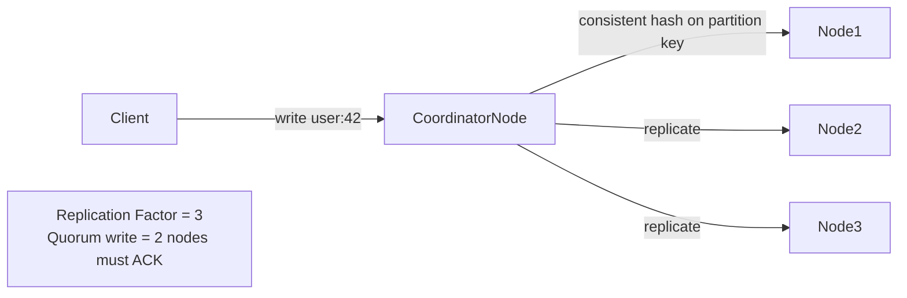

# NoSQL Databases — System Design Guide

## When to Choose NoSQL over Relational (SQL)

Use this as a decision checklist — the more boxes you check, the stronger the case for NoSQL:

| Signal | Why it points to NoSQL |
|---|---|
| **Schema is dynamic or evolving** | SQL schema changes (ALTER TABLE) are painful at scale |
| **Massive scale (billions of rows)** | Horizontal sharding is native in NoSQL; painful in SQL |
| **Extremely high write throughput** | NoSQL stores are often optimized for write-heavy workloads |
| **Data is naturally hierarchical/nested** | Joins in SQL are expensive; documents model this naturally |
| **Low-latency reads at scale** | Key-value stores return O(1) with no query planning overhead |
| **No complex relationships / joins** | If you don't need joins, you don't need SQL |
| **Geo-distributed data** | Some NoSQL DBs (Cassandra, DynamoDB) are built for multi-region |

**Stick with SQL when:**
- You need **ACID transactions** across multiple entities
- Data is **relational** with complex joins
- You need **strong consistency** guarantees
- Team is familiar with SQL and scale isn't a concern yet

> **Interview tip:** Don't jump to NoSQL just because it sounds modern. The question is always — *what does your data model and access pattern look like?*

---

## The CAP Theorem (Essential Context)
Before diving into categories — every distributed DB makes a trade-off:

```
         Consistency
              △
              │
              │
  CP ─────────┼───────── CA (not useful in distributed systems)
              │
              │
  AP ─────────┘
    Availability + Partition Tolerance
```

- **CP** (Consistency + Partition Tolerance): Returns error if can't guarantee consistent data. e.g. HBase, MongoDB (strong mode)
- **AP** (Availability + Partition Tolerance): Returns best available data even if stale. e.g. Cassandra, DynamoDB, CouchDB
- You **always** have Partition Tolerance in a real distributed system — the real choice is **C vs A**

---

## Category 1: Key-Value Stores

### What it is
The simplest NoSQL model — a giant distributed hash map. Every value is opaque (the DB doesn't know or care what's inside).

```
Key          →   Value (any blob)
"user:42"    →   { name: "Alice", age: 30 }
"session:xyz" →  "eyJhbGci..."
"counter:hits" → 10482
```

### Popular Databases

| DB | Best known for |
|---|---|
| **Redis** | In-memory, rich data structures, pub/sub |
| **DynamoDB** | AWS-native, serverless, massive scale |
| **Riak** | High availability, multi-datacenter |
| **Memcached** | Pure caching, multi-threaded |

### Use Cases
- ✅ **Session storage** — store user sessions keyed by session ID
- ✅ **Caching** — cache DB query results, API responses
- ✅ **Rate limiting** — atomic increment counters per user/IP
- ✅ **Feature flags** — fast key lookup, no query needed
- ✅ **Shopping cart** — cart keyed by user ID, value is list of items
- ✅ **Leaderboards** — Redis Sorted Sets for ranked data

### Limitations
- ❌ No query by value — you must know the key
- ❌ No relationships between keys
- ❌ Poor for complex filtering or aggregations

---

## Category 2: Document Stores

### What it is
Stores data as **self-contained JSON/BSON documents**. Unlike key-value, the DB understands the document structure and can query inside it.

```json
{
  "_id": "ord_001",
  "user_id": "usr_42",
  "status": "shipped",
  "items": [
    { "product": "laptop", "qty": 1, "price": 999 },
    { "product": "mouse",  "qty": 2, "price": 29  }
  ],
  "address": {
    "city": "San Jose",
    "zip": "95101"
  }
}
```

### Popular Databases

| DB | Best known for |
|---|---|
| **MongoDB** | Most popular document DB; rich query language |
| **CouchDB** | AP-focused; excellent sync for offline-first apps |
| **Firestore** | Google's serverless document DB; real-time sync |
| **RavenDB** | .NET ecosystem; ACID across documents |

### Use Cases
- ✅ **Product catalogs** — products have varied attributes (shirt has size/color, laptop has RAM/CPU)
- ✅ **Content management** — articles, blog posts with flexible metadata
- ✅ **User profiles** — each user may have different preference fields
- ✅ **Event/activity logs** — each event has different fields
- ✅ **Mobile/offline apps** — CouchDB/Firestore sync documents to device

### Limitations
- ❌ No joins — denormalization required (data duplication)
- ❌ Transactions across documents are limited (MongoDB 4.0+ added them but with overhead)
- ❌ Can lead to inconsistency if same data is duplicated across documents

### Key design pattern — Embed vs Reference
```
Embed (denormalize):           Reference (normalize):
Order document contains        Order document contains
full item details              item_ids → fetch separately
→ fast reads, data duplication → consistent, but needs 2 queries
```
> Rule: **Embed** if you always read together. **Reference** if data changes independently.

---

## Category 3: Column-Family Stores (Wide-Column)

### What it is
Data is stored in **rows with dynamic columns**, grouped into **column families**. Think of it as a 2D map:

```
Row Key       Column Family: profile    Column Family: activity
─────────────────────────────────────────────────────────────────
user:42       name="Alice"              last_login="2024-05-01"
              email="alice@x.com"       login_count=142
user:99       name="Bob"               (no activity columns yet)
              phone="555-1234"
```

- Rows can have **completely different columns** — sparse data is fine
- Optimized for **writes** (append-only LSM tree storage)
- Optimized for **reading a row** or **scanning a range of rows**

### Popular Databases

| DB | Best known for |
|---|---|
| **Apache Cassandra** | Masterless, AP, multi-region, massive write throughput |
| **HBase** | CP, Hadoop ecosystem, strong consistency |
| **Google Bigtable** | Google's internal; powers Gmail, Maps, Search |
| **ScyllaDB** | Cassandra-compatible, written in C++ for lower latency |

### How Cassandra Distributes Data


- **Partition key** determines which node owns the data (consistent hashing)
- **Clustering key** determines sort order within a partition
- **Replication factor** = how many copies
- **Consistency level** = how many replicas must agree (tunable per query)

### Use Cases
- ✅ **Time-series data** — IoT sensor readings, metrics (partition by device, cluster by timestamp)
- ✅ **Event logs / audit trails** — append-only, high write volume
- ✅ **Messaging systems** — messages partitioned by conversation ID
- ✅ **Recommendations / activity feeds** — wide rows per user
- ✅ **Multi-region, always-on systems** — Cassandra masterless = no SPOF

### Limitations
- ❌ **Query pattern must be known upfront** — schema is designed around queries, not data
- ❌ No ad-hoc queries — no WHERE on non-partition/clustering keys (without secondary index, which is expensive)
- ❌ No joins, no aggregations
- ❌ Updates are actually inserts with a newer timestamp (immutable log underneath)

> **Interview insight:** In Cassandra, you **design your tables around your queries**, not the other way around. This is the opposite of SQL thinking.

---

## Category 4: Graph Databases

### What it is
Data is modeled as **nodes (entities)** and **edges (relationships)**. Edges are first-class citizens — stored and indexed directly, not computed via joins.

```
(Alice)-[:FRIENDS_WITH]->(Bob)
(Bob)-[:WORKS_AT]->(Acme Corp)
(Alice)-[:PURCHASED]->(iPhone 15)
(iPhone 15)-[:MADE_BY]->(Apple)
```

### Popular Databases

| DB | Best known for |
|---|---|
| **Neo4j** | Most popular graph DB; Cypher query language |
| **Amazon Neptune** | AWS-managed; supports Gremlin + SPARQL |
| **ArangoDB** | Multi-model: graph + document + key-value |
| **TigerGraph** | Analytical graph queries at massive scale |

### Query Example (Cypher — Neo4j)
```cypher
-- Find friends of Alice who also bought iPhone 15
MATCH (alice:User {name: "Alice"})-[:FRIENDS_WITH]->(friend)
      -[:PURCHASED]->(p:Product {name: "iPhone 15"})
RETURN friend.name
```
In SQL this would be multiple self-joins — in a graph DB it's a natural traversal.

### Use Cases
- ✅ **Social networks** — friends, followers, mutual connections
- ✅ **Fraud detection** — detect rings of connected fraudulent accounts
- ✅ **Recommendation engines** — "people who bought X also bought Y"
- ✅ **Knowledge graphs** — entities and their relationships (Google Knowledge Graph)
- ✅ **Access control / permissions** — hierarchical role graphs
- ✅ **Network topology** — map dependencies between services/infrastructure

### Limitations
- ❌ Poor for bulk/aggregate queries (sum, count across all nodes)
- ❌ Doesn't scale horizontally as easily as other NoSQL (graph sharding is hard)
- ❌ Overkill if relationships are simple (a few foreign keys in SQL is fine)

---

## Side-by-Side Decision Guide

| Question | Points to… |
|---|---|
| Do I always access by a known key? | **Key-Value** |
| Is my data hierarchical/nested with variable fields? | **Document** |
| Do I have massive write throughput or time-series data? | **Column-Family** |
| Are relationships between entities the core of my queries? | **Graph** |
| Do I need full-text search? | **Elasticsearch** (not a NoSQL DB per se, but often the answer) |
| Do I need ACID transactions across entities? | **Relational (SQL)** |
| Multi-region, always-on, high availability? | **Cassandra / DynamoDB** |

---

## Failure Modes & Mitigations (Key NoSQL DBs)

| DB | Failure | Impact | Mitigation |
|---|---|---|---|
| **Cassandra** | Node goes down | Partitions owned by that node unavailable for writes at quorum | Replication factor ≥ 3; hinted handoff stores writes temporarily and replays when node recovers |
| **Cassandra** | Network partition | AP — serves stale data rather than erroring | Tune consistency level per query (`QUORUM` vs `ONE`); use `LOCAL_QUORUM` for multi-region |
| **Cassandra** | Tombstone accumulation | Range queries slow down over time | Run compaction regularly; set `gc_grace_seconds` appropriately; avoid delete-heavy workloads |
| **MongoDB** | Primary election during failover | ~10–30s write unavailability | Use retryable writes (Mongo 3.6+); driver auto-retries on primary re-election |
| **MongoDB** | Replica lag | Stale reads from secondaries | Read from primary for consistency-critical reads; use `readConcern: majority` |
| **DynamoDB** | Hot partition | Throttling on a single partition key | Use high-cardinality partition keys; add random suffix to distribute writes |

---

## Interview Talking Points
- Lead with **access patterns** — "before picking a DB, I'd ask: how will we query this data?"
- CAP theorem — know which category is CP vs AP and why it matters for your use case
- **Cassandra** — mention partition key design, replication factor, tunable consistency
- **Document stores** — mention embed vs reference trade-off; interviewers love this
- **Graph DBs** — fraud detection and social network are the two strongest interview examples
- NoSQL doesn't mean no schema — **schema still exists, it's just enforced by the application**
- Don't dismiss SQL — "I'd start with Postgres and move to NoSQL when I hit a specific scaling wall"
