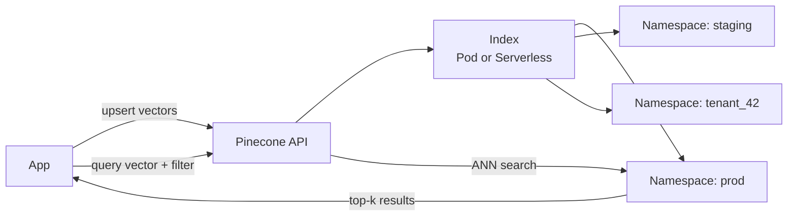
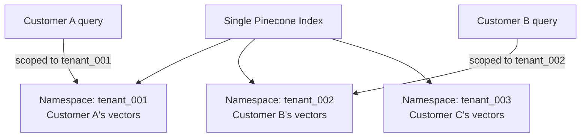
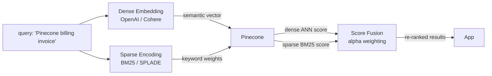
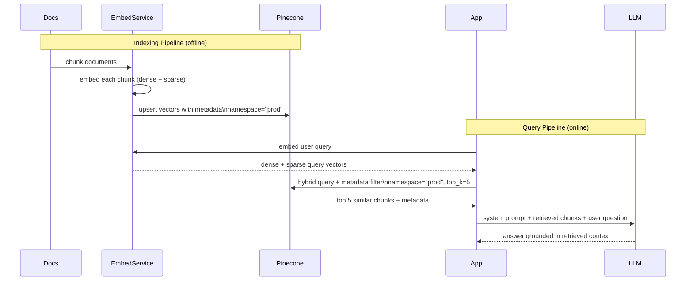

# Pinecone

## What is it?
A fully managed vector database built specifically for production AI applications. Abstracts away all infrastructure — no index tuning, no server management. You store vectors, query by similarity, filter by metadata.

---

## Core Architecture



---

## Key Concepts

| Concept | Description |
|---|---|
| **Index** | Top-level container. Holds all vectors for a use case. Defined by dimension + metric. |
| **Namespace** | Logical partition within an index. Vectors in different namespaces are completely isolated. |
| **Vector** | ID + dense float array + optional sparse vector + metadata |
| **Metadata** | Key-value pairs attached to each vector for filtering |
| **Pod-based index** | Dedicated infrastructure; predictable performance; legacy |
| **Serverless index** | Pay-per-use; scales to zero; recommended for most use cases |

---

## Namespaces — Deep Dive

Namespaces are **logical partitions within a single index**. Every upsert and query targets a specific namespace. Vectors in different namespaces never interact.

```python
# Upsert into specific namespace
index.upsert(
    vectors=[
        ("vec1", [0.1, 0.2, ...], {"category": "tech"}),
        ("vec2", [0.3, 0.4, ...], {"category": "sports"})
    ],
    namespace="tenant_42"
)

# Query scoped to namespace
index.query(
    vector=[0.1, 0.2, ...],
    top_k=10,
    namespace="tenant_42"  # only searches within this namespace
)
```

### Why Namespaces Matter



**Primary use cases for namespaces:**

| Pattern | How |
|---|---|
| **Multi-tenancy** | One namespace per customer — complete data isolation without separate indexes |
| **Environment separation** | `prod`, `staging`, `dev` namespaces in same index |
| **A/B testing** | Different embedding models → different namespaces → compare recall |
| **Versioning** | `embeddings_v1`, `embeddings_v2` — migrate gradually |
| **Content segmentation** | `docs`, `faqs`, `products` — search specific content types |

### Namespace Limits & Behavior
- No hard limit on number of namespaces per index
- Namespaces are **created implicitly** on first upsert — no setup needed
- Deleting all vectors in a namespace effectively removes it
- You **cannot** query across multiple namespaces in a single call — must query each separately and merge in app layer
- Stats are available per namespace: `index.describe_index_stats()`

```python
stats = index.describe_index_stats()
# Returns per-namespace vector counts:
# { "tenant_001": { "vector_count": 50000 },
#   "tenant_002": { "vector_count": 120000 } }
```

---

## Vector Structure

Each vector in Pinecone has four components:

```python
{
    "id": "doc_chunk_42",           # unique string ID
    "values": [0.1, -0.3, ...],     # dense vector (required)
    "sparse_values": {              # sparse vector (optional, for hybrid search)
        "indices": [10, 45, 302],
        "values":  [0.8, 0.3, 0.5]
    },
    "metadata": {                   # key-value pairs for filtering
        "source": "manual",
        "category": "billing",
        "created_at": 1716912000,
        "language": "en"
    }
}
```

---

## Metadata Filtering

Filter vectors by metadata **before or alongside** the ANN search. This scopes the similarity search to a relevant subset.

```python
# Find similar vectors but only within billing docs in English
index.query(
    vector=[0.1, 0.2, ...],
    top_k=10,
    namespace="prod",
    filter={
        "category": {"$eq": "billing"},
        "language": {"$eq": "en"},
        "created_at": {"$gte": 1700000000}
    }
)
```

### Supported Filter Operators

| Operator | Meaning |
|---|---|
| `$eq` | Equals |
| `$ne` | Not equals |
| `$gt`, `$gte` | Greater than (or equal) |
| `$lt`, `$lte` | Less than (or equal) |
| `$in` | Value in list |
| `$nin` | Value not in list |
| `$and`, `$or` | Logical combinators |

### Metadata Filtering Pitfall
Heavy metadata filtering on a large index can hurt recall — if the filter is too narrow, the ANN search has fewer vectors to work with and may miss relevant results.

**Fix:** Index metadata fields you filter on frequently. Keep metadata values low-cardinality where possible.

---

## Hybrid Search — Deep Dive

Pinecone supports **hybrid search** combining dense vectors (semantic) with sparse vectors (keyword/BM25). This is the production-grade approach — pure semantic search misses exact keyword matches.



### Dense vs Sparse Vectors

| | Dense Vector | Sparse Vector |
|---|---|---|
| **Captures** | Semantic meaning | Exact keyword matches |
| **Dimensions** | Fixed (e.g. 1536) | Up to 100,000 (mostly zeros) |
| **Good for** | Paraphrases, synonyms | Exact terms, product codes, IDs |
| **Example** | "car" ≈ "automobile" | "invoice #INV-2024-001" exact match |

### Alpha Parameter — Controlling the Balance
```python
index.query(
    vector=[0.1, 0.2, ...],          # dense vector
    sparse_vector={                   # sparse vector
        "indices": [101, 532, 890],
        "values":  [0.8, 0.4, 0.6]
    },
    top_k=10,
    alpha=0.7                         # 0.0 = pure sparse, 1.0 = pure dense
)
```

- `alpha=1.0` → pure semantic (dense only)
- `alpha=0.0` → pure keyword (sparse only)
- `alpha=0.7` → 70% semantic, 30% keyword ← typical production value

### Generating Sparse Vectors
```python
from pinecone_text.sparse import BM25Encoder

bm25 = BM25Encoder()
bm25.fit(corpus)  # fit on your document corpus

sparse_vector = bm25.encode_documents("Pinecone billing invoice")
# → { "indices": [101, 532], "values": [0.8, 0.4] }
```

Pinecone provides `pinecone-text` library with BM25 and SPLADE encoders.

---

## Serverless vs Pod-based Index

| | Serverless | Pod-based |
|---|---|---|
| **Pricing** | Per read/write unit | Per pod-hour |
| **Scaling** | Automatic | Manual pod sizing |
| **Cold start** | Possible on low traffic | None |
| **Performance** | Slightly variable | Consistent, predictable |
| **Use when** | Most use cases, variable traffic | High-throughput, latency-sensitive prod |

---

## Typical RAG Pipeline with Pinecone



---

## Failure Modes & Mitigations

| Failure | Impact | Mitigation |
|---|---|---|
| **Stale vectors after doc update** | Search returns outdated content | Upsert is idempotent — re-embed and upsert on every document change; use CDC to trigger |
| **Namespace query returns poor results** | Relevant vectors in other namespaces missed | Design namespaces carefully; if cross-namespace search needed, query each and merge in app |
| **Metadata filter too narrow** | Low recall — few candidates for ANN | Widen filter; index frequently-filtered fields; monitor recall metrics |
| **Alpha tuning wrong** | Too semantic → misses exact matches; too sparse → misses paraphrases | Evaluate with test queries; start at alpha=0.7 and tune |
| **Embedding model changed** | Old vectors incompatible with new queries | Re-embed all docs into new namespace; switch namespace pointer when ready; delete old |
| **Serverless cold start** | First query slow after idle period | Use pod-based for latency-sensitive; keep index warm with periodic pings |

---

## Interview Talking Points
- Namespaces = **multi-tenancy without multiple indexes** — one index, isolated per customer/env
- Cannot query across namespaces — **must merge in app layer** if needed
- Hybrid search with **alpha parameter** — dense for semantics, sparse for exact keywords
- Upsert is **idempotent** — same ID overwrites; safe to re-index on document changes
- **Re-embed on model change** — version with namespaces, migrate gradually
- Serverless for most use cases; pod-based when you need consistent low latency
