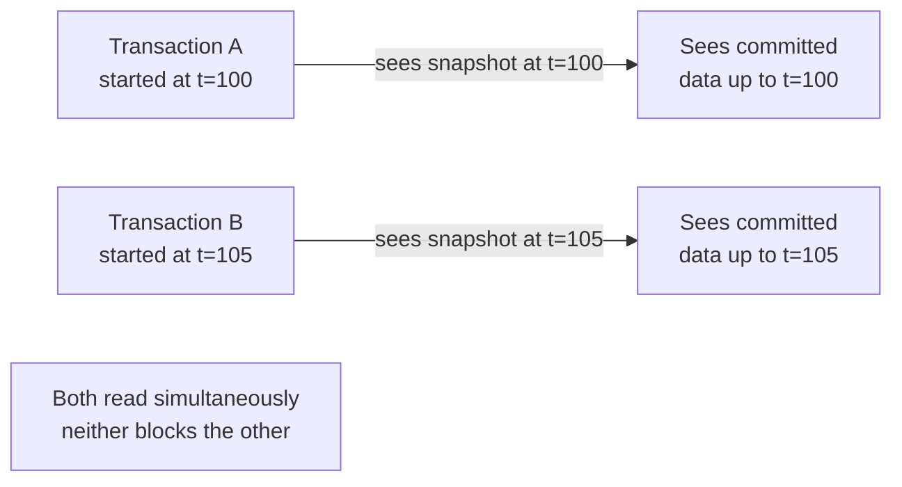
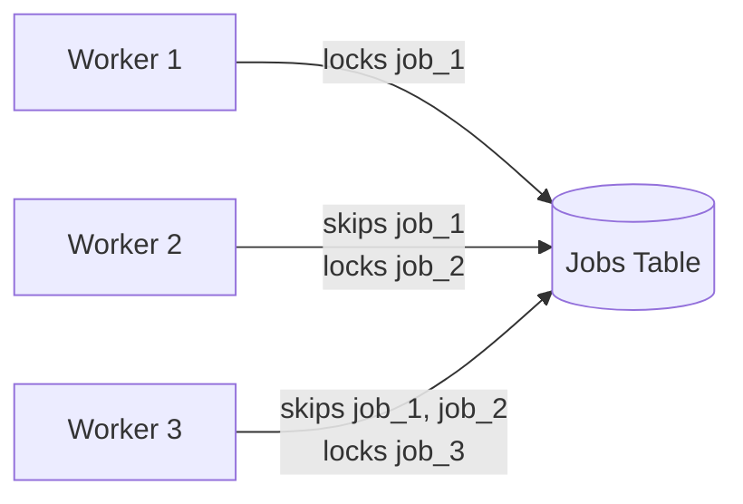
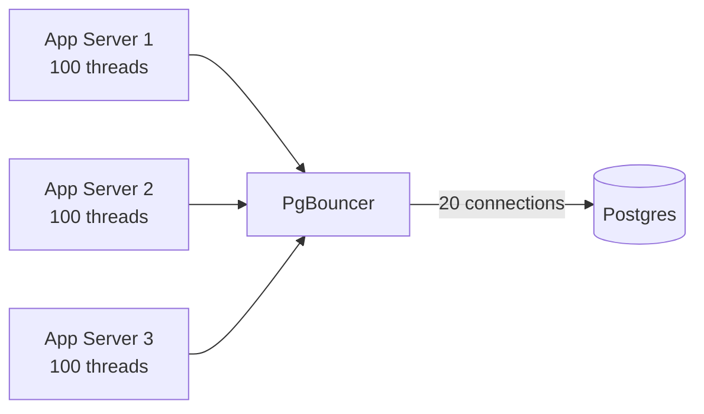

# PostgreSQL

## What is it?
The most popular open-source relational database. ACID-compliant, highly extensible, and battle-tested at scale. In system design, Postgres is often the default starting point — it does more than most people realize before you need to reach for specialized tools.

---

## MVCC — How Postgres Handles Concurrency Internally
**Multi-Version Concurrency Control** — the engine underneath all of Postgres's concurrency features.

Instead of locking rows on read, Postgres keeps **multiple versions of each row**:

```
Row id=42 timeline:
  xmin=100, xmax=null  → "Alice"   (current version, written by txn 100)
  xmin=80,  xmax=100   → "Al"      (old version, overwritten by txn 100)
  xmin=60,  xmax=80    → "A"       (older version)
```

- Every row has `xmin` (transaction that created it) and `xmax` (transaction that deleted/updated it)
- Each transaction sees a **snapshot** of the DB as of when it started
- Readers never block writers, writers never block readers
- Old versions cleaned up by **VACUUM** process



> **Why it matters:** MVCC is why Postgres can have high read concurrency without read locks — important when explaining why reads scale well.

---

## Isolation Levels

Isolation levels control what a transaction can see from concurrent transactions. Higher isolation = fewer anomalies = lower throughput.

### The Anomalies

| Anomaly | What happens |
|---|---|
| **Dirty Read** | Read uncommitted data from another transaction that may roll back |
| **Non-repeatable Read** | Read same row twice, get different values (another txn committed between reads) |
| **Phantom Read** | Re-run a range query, get different rows (another txn inserted/deleted) |
| **Serialization Anomaly** | Two transactions produce a result impossible if run serially |

### Isolation Levels in Postgres

| Level | Dirty Read | Non-repeatable Read | Phantom Read | Serialization Anomaly |
|---|---|---|---|---|
| **READ COMMITTED** (default) | ❌ Never | ✅ Possible | ✅ Possible | ✅ Possible |
| **REPEATABLE READ** | ❌ Never | ❌ Never | ❌ Never* | ✅ Possible |
| **SERIALIZABLE** | ❌ Never | ❌ Never | ❌ Never | ❌ Never |

*Postgres REPEATABLE READ also prevents phantom reads (stronger than SQL standard requires)

### READ COMMITTED (Default)
Each statement within a transaction sees the latest committed data at the time that statement runs.

```sql
BEGIN;
SELECT balance FROM accounts WHERE id = 1;  -- sees $1000
-- Another transaction commits: balance = $800
SELECT balance FROM accounts WHERE id = 1;  -- sees $800 ← non-repeatable read
COMMIT;
```
- ✅ Good throughput, minimal blocking
- ❌ Non-repeatable reads possible
- **Use when:** most general-purpose OLTP workloads

### REPEATABLE READ
Transaction sees a snapshot of the DB as of when the transaction started. Same row always returns same value.

```sql
BEGIN ISOLATION LEVEL REPEATABLE READ;
SELECT balance FROM accounts WHERE id = 1;  -- sees $1000
-- Another transaction commits: balance = $800
SELECT balance FROM accounts WHERE id = 1;  -- still sees $1000 ✅
COMMIT;
```
- ✅ Consistent view throughout transaction
- ❌ Write conflicts cause transaction to abort and retry
- **Use when:** reports, analytics queries that span multiple reads, financial summaries

### SERIALIZABLE
Strongest isolation. Transactions behave as if executed one at a time serially. Uses **Serializable Snapshot Isolation (SSI)** — detects dangerous read/write dependencies and aborts conflicting transactions.

```sql
BEGIN ISOLATION LEVEL SERIALIZABLE;
-- Complex multi-table operations
-- Postgres tracks read/write dependencies
-- If a serialization anomaly is detected → transaction aborted → retry
COMMIT;
```
- ✅ Complete correctness guarantee
- ❌ Higher abort rate under contention — must handle retries
- **Use when:** financial transfers, inventory allocation, anything requiring strict correctness

---

## Row-Level Locking

### SELECT FOR UPDATE
Locks selected rows. Other transactions trying to lock same rows will block.

```sql
BEGIN;
SELECT * FROM seats WHERE id = 42 AND status = 'available' FOR UPDATE;
-- Row 42 is now locked 🔒
UPDATE seats SET status = 'booked' WHERE id = 42;
COMMIT; -- lock released
```

### SELECT FOR SHARE
Multiple transactions can hold a share lock simultaneously. Blocks exclusive locks (FOR UPDATE) but not other share locks.

```sql
-- Good for reading a parent row while preventing it from being deleted
SELECT * FROM orders WHERE id = 99 FOR SHARE;
```

### SELECT FOR UPDATE SKIP LOCKED
Skip rows that are already locked — don't wait. Perfect for job queues.

```sql
-- Multiple workers pulling jobs concurrently — no worker blocks another
SELECT * FROM jobs
WHERE status = 'pending'
ORDER BY created_at
LIMIT 1
FOR UPDATE SKIP LOCKED;
```



- ✅ Each worker gets a different job — no contention
- ✅ No blocking — workers proceed immediately
- **Use when:** Postgres as a job queue, task processing, any work distribution pattern

### SELECT FOR NO KEY UPDATE
Weaker than FOR UPDATE — locks the row but allows other transactions to insert foreign key children. Useful for updating non-key columns.

### Lock Comparison

| Lock Mode | Blocks other FOR UPDATE? | Blocks other FOR SHARE? | Use case |
|---|---|---|---|
| `FOR UPDATE` | ✅ Yes | ✅ Yes | Exclusive modification |
| `FOR NO KEY UPDATE` | ✅ Yes | ❌ No | Update non-key columns |
| `FOR SHARE` | ❌ No | ❌ No | Read with delete protection |
| `FOR KEY SHARE` | ❌ No | ❌ No | FK check |

---

## Optimistic Concurrency Control

No DB locks — use application-level version checking.

```sql
-- Schema
ALTER TABLE products ADD COLUMN version INTEGER DEFAULT 1;

-- Read
SELECT id, stock, version FROM products WHERE id = 42;
-- Returns: stock=10, version=5

-- Write — only if version unchanged
UPDATE products
SET stock = stock - 1,
    version = version + 1
WHERE id = 42
  AND version = 5;       -- optimistic check

-- In application:
-- rowsAffected == 1 → success
-- rowsAffected == 0 → conflict → retry or error
```

```java
public boolean decrementStock(long productId, int expectedVersion) {
    int rows = jdbcTemplate.update(
        "UPDATE products SET stock = stock - 1, version = version + 1 " +
        "WHERE id = ? AND version = ? AND stock > 0",
        productId, expectedVersion
    );
    return rows == 1; // false = conflict or out of stock
}
```

- ✅ No locks held — high throughput
- ✅ Good for low-contention scenarios
- ❌ Application must handle retries on conflict
- **Use when:** product updates, profile edits, anything with infrequent concurrent writes

---

## Indexes in Postgres

### B-Tree (Default)
```sql
CREATE INDEX idx_users_email ON users(email);
```
- Good for: equality, range queries, ORDER BY, BETWEEN
- Default for most use cases

### GIN (Generalized Inverted Index)
```sql
CREATE INDEX idx_docs_content ON documents USING GIN(to_tsvector('english', content));
```
- Good for: full-text search, JSONB containment, arrays
- Faster reads, slower writes

### GiST (Generalized Search Tree)
```sql
CREATE INDEX idx_locations_geom ON locations USING GIST(geom);
```
- Good for: geospatial queries (PostGIS), range types, nearest-neighbor

### BRIN (Block Range Index)
```sql
CREATE INDEX idx_events_created ON events USING BRIN(created_at);
```
- Good for: very large tables with naturally ordered data (timestamps, sequential IDs)
- Tiny size — stores min/max per block range
- **Use when:** append-only time-series tables

### Partial Index
```sql
-- Index only active users — smaller, faster
CREATE INDEX idx_active_users ON users(email) WHERE status = 'active';
```

### Covering Index (INCLUDE)
```sql
-- Include extra columns to avoid heap fetch entirely
CREATE INDEX idx_orders_user ON orders(user_id) INCLUDE (status, total);
-- Query can be satisfied from index alone — no table lookup needed
```

---

## Partitioning

Split large tables into smaller physical chunks while appearing as one table.

```sql
-- Range partitioning by month
CREATE TABLE events (
    id BIGINT,
    created_at TIMESTAMP,
    data JSONB
) PARTITION BY RANGE (created_at);

CREATE TABLE events_2024_01 PARTITION OF events
    FOR VALUES FROM ('2024-01-01') TO ('2024-02-01');

CREATE TABLE events_2024_02 PARTITION OF events
    FOR VALUES FROM ('2024-02-01') TO ('2024-03-01');
```

- Queries automatically **pruned** to relevant partitions
- Old partitions can be **detached and archived** cheaply
- **Use when:** time-series data, large append-only tables, log storage

---

## Connection Pooling — PgBouncer
Postgres has a process-per-connection model — too many connections = high memory + slow.



- 300 app threads → 20 actual DB connections
- **Transaction mode** (recommended) — connection returned to pool after each transaction
- ✅ Reduces Postgres memory pressure dramatically
- **Always use PgBouncer in production** between app and Postgres

---

## EXPLAIN ANALYZE — Query Performance

```sql
EXPLAIN ANALYZE
SELECT * FROM orders WHERE user_id = 42 AND status = 'pending';

-- Output:
-- Seq Scan on orders (cost=0.00..1500.00 rows=1 width=200)
--   Filter: (user_id = 42 AND status = 'pending')
-- Planning time: 0.5ms
-- Execution time: 320ms  ← too slow
```

Key things to look for:
- **Seq Scan** on large table → missing index
- **Nested Loop** on large result sets → consider Hash Join
- **High rows estimate vs actual** → stale statistics, run `ANALYZE`

---

## Failure Modes & Mitigations

| Failure | Impact | Mitigation |
|---|---|---|
| **Too many connections** | Postgres OOM, connection refused | PgBouncer connection pooling |
| **Long-running transactions** | Table bloat, lock contention, VACUUM blocked | Set `statement_timeout` and `idle_in_transaction_session_timeout` |
| **Table bloat from MVCC** | Slow queries, disk pressure | Regular VACUUM; autovacuum tuning; avoid long transactions |
| **Serializable txn aborted** | Transaction must retry | Implement retry logic with exponential backoff |
| **Deadlock** | Both transactions aborted | Acquire locks in consistent order; keep transactions short |
| **Missing index on large table** | Seq scan → slow queries | EXPLAIN ANALYZE to detect; add index; consider partial/covering indexes |
| **Replication lag** | Stale reads on replica | Monitor lag; route critical reads to primary |

---

## Interview Talking Points
- **MVCC** is why readers don't block writers in Postgres — mention this when discussing read scalability
- Default isolation is **READ COMMITTED** — know when to upgrade to REPEATABLE READ or SERIALIZABLE
- `SKIP LOCKED` is the secret weapon for **Postgres as a job queue** — no external queue needed for simple cases
- **PgBouncer** is non-negotiable in production — always mention it
- Partitioning + BRIN index for **time-series data** — cheap and effective
- Covering indexes (`INCLUDE`) to avoid heap fetches — shows index depth
- EXPLAIN ANALYZE before adding indexes — shows you diagnose before acting
