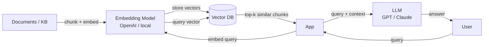
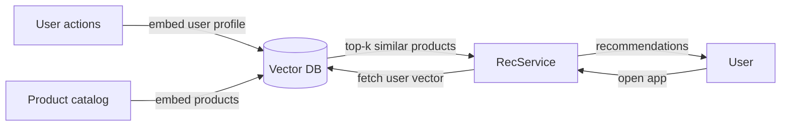

# Vector Databases

## What is it?
A database optimized for storing and querying **high-dimensional vectors** (embeddings). Instead of exact lookups by ID or keyword, you query by **semantic similarity** — "find me the N most similar items to this one."

---

## Why Vectors?
Machine learning models (BERT, GPT, CLIP) convert unstructured data into dense numerical vectors called **embeddings**:

```
"A dog playing in the park"  →  [0.21, -0.54, 0.83, 0.12, ...]  (768 dimensions)
"A puppy running on grass"   →  [0.23, -0.51, 0.79, 0.15, ...]  (similar vector)
"Stock market crash"         →  [-0.67, 0.32, -0.41, 0.88, ...] (very different)
```

Semantically similar content produces **geometrically close vectors**. Vector DBs exploit this to answer: *"what is closest to this query vector?"*

---

## The Core Operation — Approximate Nearest Neighbor (ANN)

Exact nearest neighbor search across millions of 768-dim vectors is too slow (O(n) per query). Vector DBs use **ANN algorithms** — trade tiny accuracy loss for massive speed gains.

### HNSW (Hierarchical Navigable Small World) — Most Common
Builds a multi-layer graph where each node connects to its nearest neighbors:

```
Layer 2 (sparse):   A ──────────────── F
                    │                  │
Layer 1 (medium):   A ──── C ───────── F
                    │      │           │
Layer 0 (dense):    A ─ B ─ C ─ D ─ E ─ F

Query: find nearest to Q
→ Start at top layer, greedily navigate toward Q
→ Drop to lower layer, refine search
→ Return nearest neighbors from bottom layer
```

- ✅ Very fast query (logarithmic)
- ✅ High recall (finds true nearest neighbors >95% of time)
- ❌ High memory usage (graph stored in RAM)
- ❌ Index build time is slow

### IVF (Inverted File Index)
Clusters vectors into buckets (like k-means). Query searches only nearby clusters.

```
All vectors clustered into 1000 buckets
Query → find nearest 10 clusters → search only those → return top results
```

- ✅ Lower memory than HNSW
- ❌ Lower recall if query falls near cluster boundary

---

## Core Concepts

| Concept | Description |
|---|---|
| **Embedding** | Dense vector representation of data (text, image, audio) |
| **Similarity metric** | How distance is measured: Cosine similarity, Euclidean distance, Dot product |
| **k-NN query** | "Find k nearest neighbors to this vector" |
| **ANN** | Approximate nearest neighbor — fast but not exact |
| **Namespace / Collection** | Logical grouping of vectors (like a table) |
| **Metadata filtering** | Filter by structured fields alongside vector search |

### Similarity Metrics
```
Cosine similarity:  angle between vectors (ignores magnitude) → best for text
Euclidean distance: straight-line distance → best for image embeddings
Dot product:        magnitude + direction → best for recommendation scores
```

---

## Architecture — How It Fits in a System

### RAG (Retrieval Augmented Generation) — Most Common Pattern


- Documents are chunked, embedded, stored in vector DB
- At query time: embed the question → find similar chunks → pass as context to LLM
- LLM answers using retrieved context — reduces hallucination
- **Use cases:** semantic search, chatbots over private docs, code search

### Recommendation System


---

## Popular Vector Databases

| DB | Notes |
|---|---|
| **Pinecone** | Fully managed; simple API; most popular for RAG |
| **Weaviate** | Open source; hybrid search (vector + keyword); built-in embedding models |
| **Qdrant** | Open source; Rust-based; high performance; rich filtering |
| **Chroma** | Lightweight; popular for local dev and prototyping |
| **Milvus** | Open source; large scale; GPU support |
| **pgvector** | Postgres extension — add vector search to existing Postgres |
| **Redis Vector** | Vector search built into Redis Stack |
| **Elasticsearch** | Added dense vector support — hybrid text + semantic search |

> **pgvector** is worth highlighting — if you're already on Postgres, you can add vector search without a new system. Tradeoff: doesn't scale as well as dedicated vector DBs for very large datasets.

---

## Hybrid Search
Combining vector similarity with traditional keyword/filter search:

```
Query: "lightweight running shoes under $100"

Vector search:  finds semantically similar products
Keyword filter: price < 100 AND category = "running"

Result: merge and re-rank both result sets
```

- Most production systems use **hybrid** — pure vector search misses exact keyword matches
- Weaviate, Elasticsearch, Qdrant all support this natively

---

## Vector DB vs Traditional DB

| | Traditional DB | Vector DB |
|---|---|---|
| **Query type** | Exact match, range, joins | Similarity search |
| **Data type** | Structured (rows, columns) | High-dimensional vectors |
| **Index type** | B-Tree, Hash | HNSW, IVF |
| **Use case** | Transactional, relational | Semantic search, recommendations, RAG |
| **Consistency** | Strong ACID | Eventual (mostly) |

> Vector DBs are a **complement** to relational DBs, not a replacement. Store structured data in Postgres, vectors in a vector DB, join on ID.

---

## Failure Modes & Mitigations

| Failure | Impact | Mitigation |
|---|---|---|
| **Index not in memory (HNSW)** | Query latency spikes | Ensure vector index fits in RAM; use IVF for memory-constrained environments |
| **Embedding model changes** | Old vectors incompatible with new queries | Re-embed entire dataset on model change; version your embeddings |
| **Stale vectors** | Search returns outdated results | Re-embed on document update; use CDC to trigger re-embedding pipeline |
| **ANN recall too low** | Relevant results missed | Tune ef_search (HNSW) or nprobe (IVF); increase k and re-rank |
| **Metadata filter + vector search slow** | Combined queries time out | Pre-filter by metadata first, then vector search on subset |

---

## Interview Talking Points
- Vector DBs answer **"find similar"** not **"find exact"** — make this distinction early
- HNSW is the dominant index algorithm — explain the layered graph navigation at a high level
- **RAG** is the most common interview context — walk through the embed → store → retrieve → LLM flow
- **pgvector** is a pragmatic answer for smaller scale — shows you don't over-engineer
- Hybrid search (vector + keyword + filter) is what production systems use — pure ANN is rarely enough
- Vectors must be **re-embedded if the model changes** — operational concern worth flagging
