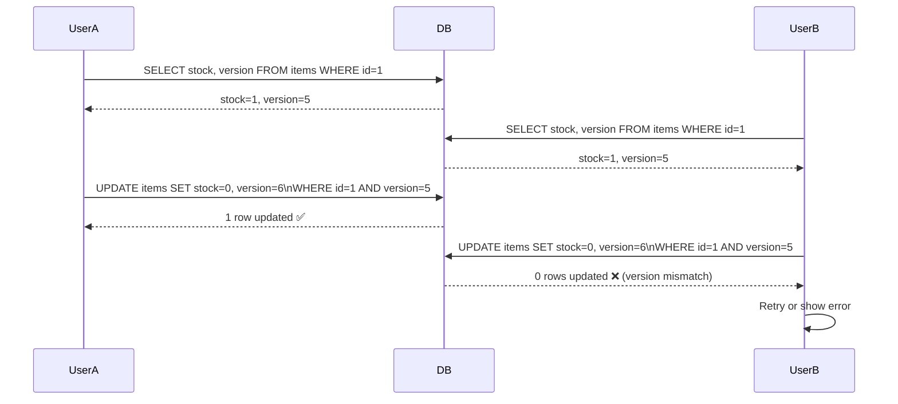
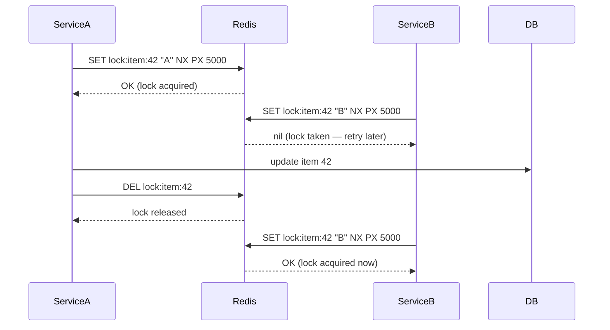
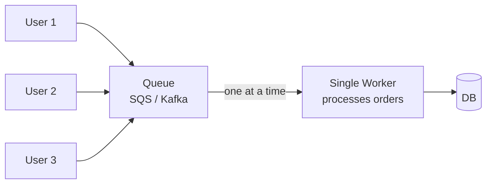

# Dealing with Contention

## What is it?
Contention happens when multiple processes/users compete for the same resource simultaneously — leading to race conditions, data corruption, or inconsistency. Common in inventory systems, ticketing, banking, and any shared counter.

---

## The Core Problem — Race Condition

```
User A reads stock = 1
User B reads stock = 1
User A writes stock = 0  (buys last item)
User B writes stock = 0  (also buys last item — oversold!)
```

---

## Solutions

### 1. Optimistic Locking
Assume conflicts are rare. Read freely, but check at write time that nothing changed.



- ✅ No locks held — high throughput
- ✅ Good when conflicts are rare
- ❌ Retry logic needed on conflict
- **Use when:** low contention, read-heavy (e.g. profile updates, CMS edits)

---

### 2. Pessimistic Locking
Assume conflicts are likely. Lock the row before reading.

```sql
BEGIN;
SELECT stock FROM items WHERE id=1 FOR UPDATE;  -- locks the row
UPDATE items SET stock = stock - 1 WHERE id=1;
COMMIT;
-- Lock released — other transactions now unblock
```

- ✅ Guaranteed no conflicts
- ❌ Other transactions block and wait — lower throughput
- ❌ Risk of **deadlocks** if multiple rows locked in different orders
- **Use when:** high contention, write-heavy (e.g. flash sales, seat booking)

---

### 3. Distributed Locks (Redis Redlock)
For contention across multiple services (not just DB rows) — use a distributed lock.



- `NX` = only set if not exists
- `PX 5000` = auto-expire after 5s (prevents deadlock if service crashes)
- ✅ Works across microservices
- ❌ Redis itself can be a SPOF — use Redlock algorithm (majority of 5 Redis nodes)
- **Use when:** distributed coordination (job scheduling, rate limiting, leader election)

---

### 4. Database Atomic Operations
Use DB-level atomic operations — no application-level locking needed.

```sql
-- Atomic decrement with guard
UPDATE items
SET stock = stock - 1
WHERE id = 1 AND stock > 0;

-- Check affected rows — if 0, item was out of stock
```

Or with Redis:
```
DECR stock:item:42   -- atomic decrement
```

- ✅ Simplest approach for counters and numeric fields
- ✅ No deadlocks
- ❌ Limited to simple numeric operations

---

### 5. Queue-based Serialization
Funnel all writes through a single queue — process one at a time.



- ✅ Zero contention — serialized by design
- ✅ Handles traffic spikes (queue absorbs bursts)
- ❌ Adds latency
- ❌ Single worker = throughput bottleneck (partition by resource ID to parallelize)
- **Use when:** flash sales, ticket purchases, any high-contention write

---

## Decision Guide

| Scenario | Best Approach |
|---|---|
| Low contention, occasional conflicts | Optimistic locking |
| High contention, must not oversell | Pessimistic locking or queue |
| Cross-service coordination | Distributed lock (Redis) |
| Simple counters | Atomic DB/Redis operations |
| Traffic spike, order processing | Queue-based serialization |

---

## Failure Modes & Mitigations

| Failure | Impact | Mitigation |
|---|---|---|
| **Deadlock** (pessimistic locking) | Transactions block each other forever | Always acquire locks in consistent order; set lock timeouts |
| **Redis lock node crashes** | Lock lost — two services enter critical section | Use Redlock (majority of N Redis nodes); set short TTL as safety net |
| **Optimistic lock starvation** | High-contention key causes infinite retries | Add backoff + jitter on retry; fall back to pessimistic under high contention |
| **Queue worker crashes mid-process** | Order lost or double-processed | Idempotency keys + at-least-once delivery + deduplication on consumer side |

---

## Interview Talking Points
- Lead with **optimistic vs pessimistic** trade-off — contention level drives the choice
- For distributed systems — always mention **Redis distributed lock** with TTL expiry
- Queue serialization is the most scalable for flash sales — mention partitioning by resource ID to parallelize
- **Idempotency** is the companion pattern — if you retry, make sure double-processing is safe
