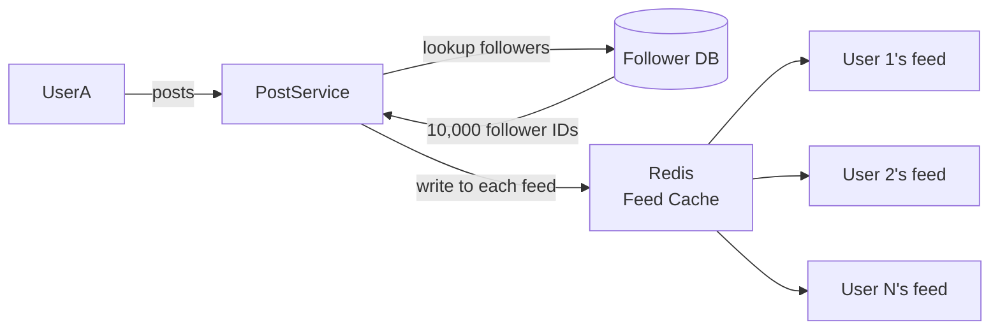
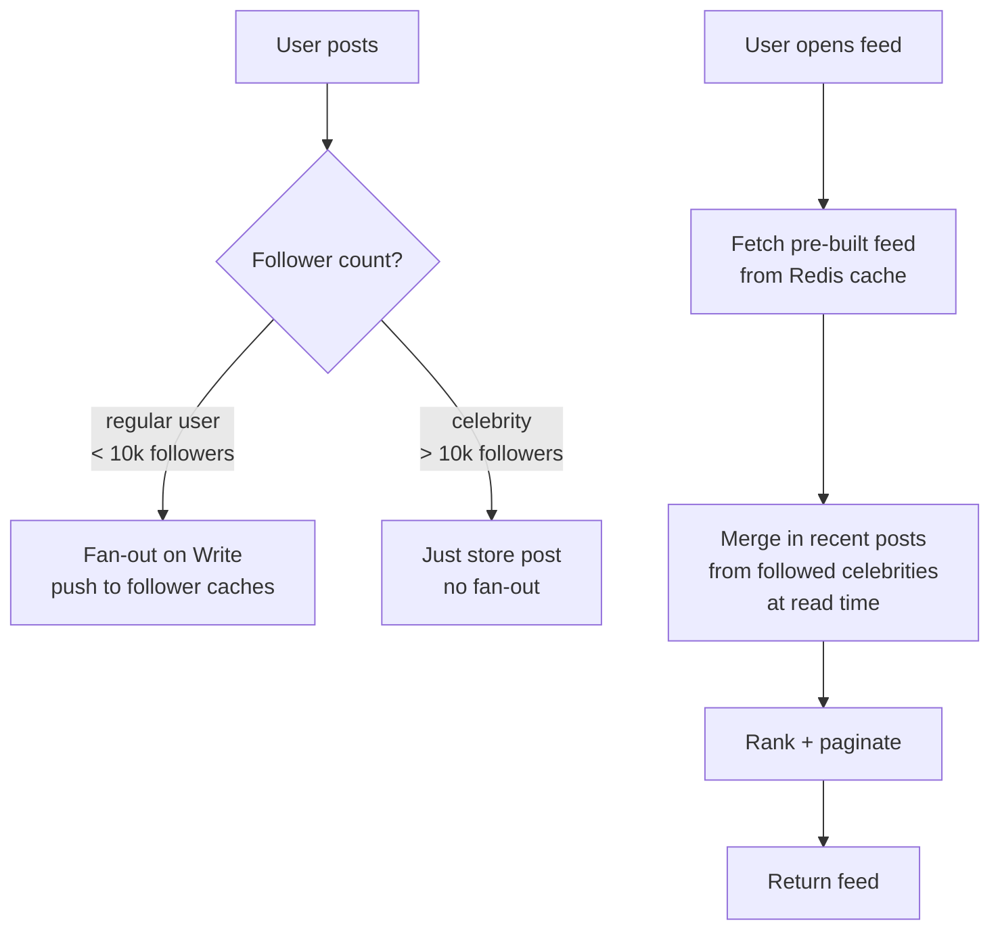

# Fan-out Patterns

## What is it?
Fan-out describes how you **distribute content from one user to many**. The classic example is a Twitter/Instagram feed — when someone posts, how does that post appear in all their followers' feeds?

There are two approaches and the choice has massive system design implications.

---

## Fan-out on Write (Push Model)
When a user posts, **immediately push the post to every follower's feed cache**.



### Read path (super fast)
```
User opens app → GET /feed → read pre-built feed from Redis → done
```

- ✅ **Read is O(1)** — feed is pre-built, just fetch it
- ✅ Low read latency — ideal for most users
- ❌ **Write amplification** — one post triggers N writes (N = follower count)
- ❌ **Celebrity problem** — user with 10M followers triggers 10M cache writes on every post
- ❌ Wasted work — writing to feeds of inactive users who never open the app

**Use when:** users have a moderate follower count; read speed is the priority

---

## Fan-out on Read (Pull Model)
When a user opens their feed, **pull and merge posts from everyone they follow in real time**.

```mermaid
flowchart LR
    User -->|open feed| FeedService
    FeedService -->|get following list| FollowerDB[(Follower DB)]
    FollowerDB -->|[UserA, UserB, UserC...]| FeedService
    FeedService -->|fetch recent posts| PostDB1[(Posts by UserA)]
    FeedService -->|fetch recent posts| PostDB2[(Posts by UserB)]
    FeedService -->|fetch recent posts| PostDB3[(Posts by UserC)]
    FeedService -->|merge + rank + paginate| User
```

- ✅ **Write is O(1)** — posting is cheap, just store the post once
- ✅ No wasted work — only computed when user actually opens feed
- ✅ Always fresh — no stale cache to invalidate
- ❌ **Read is expensive** — N DB lookups per feed load (N = accounts followed)
- ❌ High read latency — merge + rank at read time is slow
- ❌ Hard to scale for users who follow thousands of accounts

**Use when:** users follow a large number of accounts; write volume is the bottleneck

---

## Direct Comparison

| | Fan-out on Write | Fan-out on Read |
|---|---|---|
| **Write cost** | High (N writes per post) | Low (1 write per post) |
| **Read cost** | Low (pre-built feed) | High (N reads per feed load) |
| **Latency** | Read: very fast | Read: slow |
| **Celebrity problem** | ❌ Severe | ✅ No issue |
| **Inactive users** | ❌ Wastes cache writes | ✅ No wasted work |
| **Data freshness** | Slightly stale (cache) | Always fresh |
| **Best for** | Regular users | High-follower accounts |

---

## The Hybrid Approach (How Twitter/Instagram Actually Do It)

Neither pure model works at scale. The solution is a **hybrid**:



**The hybrid logic:**
- **Regular users** → fan-out on write (push to follower caches)
- **Celebrity users** (above a follower threshold) → skip fan-out; their posts are pulled at read time and merged into the feed
- Feed read = cached feed + real-time merge of celebrity posts

- ✅ Fast reads for most users (pre-built cache)
- ✅ No write amplification from celebrities
- ✅ Scales to billions of users

---

## Feed Storage Model (Redis)

Each user's feed is stored as a **sorted set** in Redis, scored by timestamp:

```
Key: feed:user:42
Type: Sorted Set
Members: [ post_id_1, post_id_2, post_id_3 ... ]
Score: timestamp (for ordering)

ZREVRANGE feed:user:42 0 19  → get latest 20 posts
```

- Cap feed size (e.g. last 1000 posts) — trim with `ZREMRANGEBYRANK`
- Store **post IDs only**, not full post content — fetch full content separately
- TTL the feed key for inactive users to reclaim memory

---

## Failure Modes & Mitigations

| Failure | Impact | Mitigation |
|---|---|---|
| **Fan-out queue backs up** | Feed delivery delayed for followers | Async fan-out via Kafka; prioritize active users; skip inactive users |
| **Redis cache evicts feed** | User gets empty or stale feed | Rebuild feed from DB on cache miss; keep TTL long for active users |
| **Celebrity post goes viral** | Sudden spike in fan-out on read merges | Cache celebrity posts separately with short TTL; rate limit merge queries |
| **Follower DB slow** | Fan-out lookup becomes bottleneck | Cache follower lists in Redis; paginate fan-out in batches |

---

## Interview Talking Points
- Never pick one model blindly — **always propose the hybrid** for any large-scale feed system
- The **celebrity problem** is the key reason pure fan-out on write fails — bring it up proactively
- Redis sorted sets are the standard data structure for storing pre-built feeds
- Fan-out should be **async via a queue** (Kafka) — never block the post API on fan-out
- Store **IDs in the feed, not full content** — content can change (edits, deletes); IDs are stable
- This pattern applies beyond social feeds — notification delivery, activity streams, leaderboard updates
