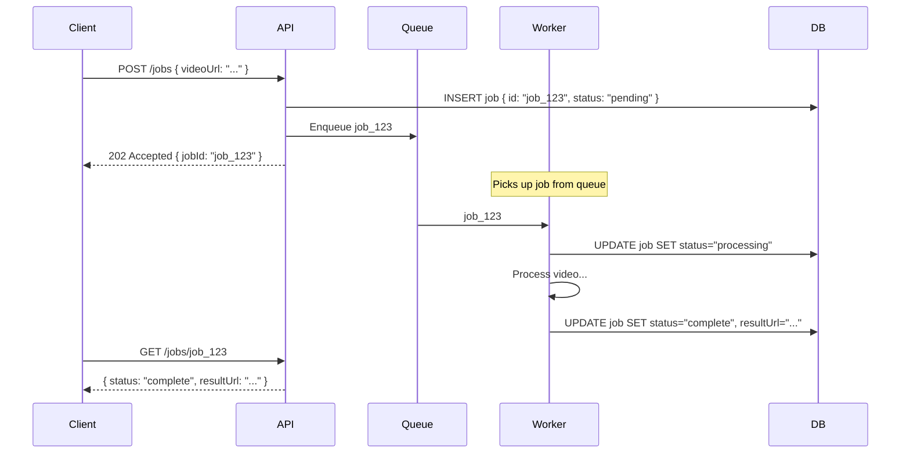
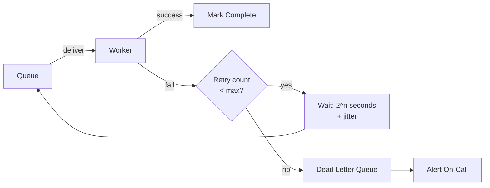
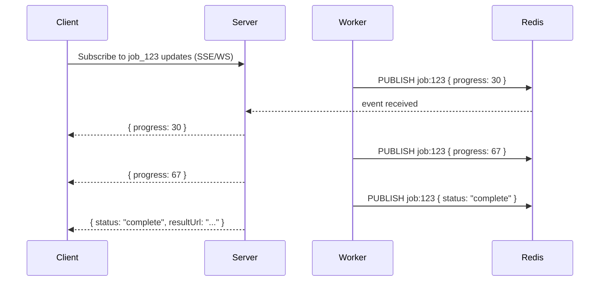
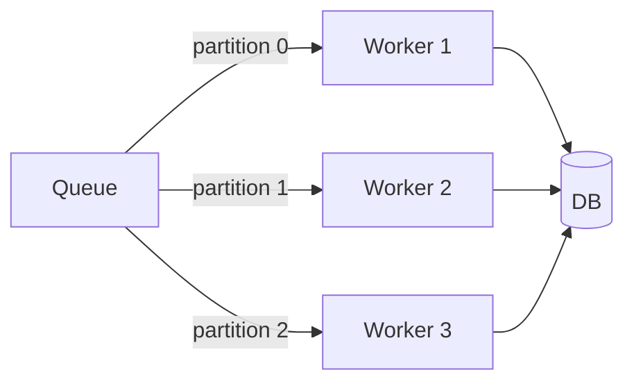

# Managing Long Running Tasks

## What is it?
Patterns for handling operations that take too long to complete in a single HTTP request — video transcoding, report generation, bulk imports, ML inference, email campaigns. The core idea: **accept the request immediately, process asynchronously, notify when done**.

---

## The Problem
```
Client → POST /transcode-video → Server processes 10min video...
                                 ...client times out after 30s ❌
```

---

## The Core Pattern — Async Job with Status Polling



- Client gets `202 Accepted` immediately with a job ID
- Client polls `GET /jobs/{id}` to check status
- ✅ No timeouts, no blocking
- ✅ Client can check progress, display status bar

---

## Job Status Machine

```
PENDING → QUEUED → PROCESSING → COMPLETE
                             ↘ FAILED → (retry) → PROCESSING
                                      → DEAD (max retries exceeded)
```

Always persist status in DB — worker crashes are survivable.

---

## Queue Options

| Queue | Best for |
|---|---|
| **Kafka** | High throughput, durable, replayable, ordered |
| **SQS** | AWS-native, simple, at-least-once delivery |
| **RabbitMQ** | Complex routing, priority queues |
| **Redis (BullMQ)** | Simple jobs, same-infra, fast |
| **Celery + Redis/RabbitMQ** | Python ecosystem |

---

## Retry Strategy
Workers will fail. Always design for retries.



- **Exponential backoff with jitter** — `wait = 2^attempt + rand(0, 1)`
- **Max retries** (e.g. 3–5) before sending to Dead Letter Queue (DLQ)
- DLQ = holding area for failed jobs — inspect, fix, replay manually

---

## Idempotency for Workers
Jobs can be delivered more than once (at-least-once queues). Workers must be safe to run twice.

```java
public void processJob(String jobId) {
    Job job = db.findJob(jobId);

    // Idempotency check
    if (job.getStatus() == Status.COMPLETE) {
        return; // already processed — skip safely
    }

    // Atomic status transition — prevent double processing
    int updated = db.updateJobStatus(jobId, Status.PROCESSING, Status.QUEUED);
    if (updated == 0) {
        return; // another worker grabbed it first
    }

    // Do the actual work
    doWork(job);
    db.updateJobStatus(jobId, Status.COMPLETE, Status.PROCESSING);
}
```

---

## Progress Tracking
For long jobs, clients want progress updates — not just pending/complete.

### Option A — Polling with progress field
```json
GET /jobs/job_123
{
  "status": "processing",
  "progress": 67,
  "eta_seconds": 45
}
```

### Option B — WebSocket / SSE push


---

## Worker Scaling



- Scale workers horizontally — add more consumers
- Kafka partitions = max parallelism ceiling (1 consumer per partition)
- Use **priority queues** for urgent jobs (paid users jump the queue)

---

## Failure Modes & Mitigations

| Failure | Impact | Mitigation |
|---|---|---|
| **Worker crashes mid-job** | Job stuck in "processing" | Heartbeat timeout — if no heartbeat in N seconds, reset to "queued" for retry |
| **Job delivered twice** | Duplicate processing | Idempotency check on job status before processing |
| **DLQ fills up** | Silent failures | Alert on DLQ size; build replay tooling |
| **Queue backlog grows** | Jobs delayed | Auto-scale workers; shed load with priority queues |
| **Result storage fails** | Job completes but result lost | Store result in blob storage (S3); store URL in DB separately from job completion |

---

## Interview Talking Points
- Always return **202 Accepted** with a job ID — never make the client wait
- Persist job state in DB — worker crashes must be recoverable
- **Idempotency** on workers is non-negotiable with at-least-once queues
- Mention **DLQ** — shows operational maturity
- For progress updates: polling is simple, SSE/WebSocket is better UX — pick based on requirements
- **Heartbeat timeout** to detect stuck jobs — interviewers rarely hear this
