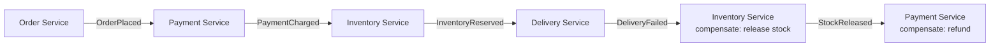
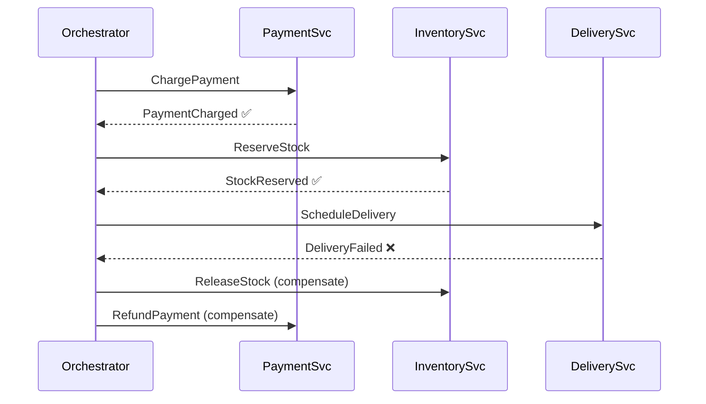
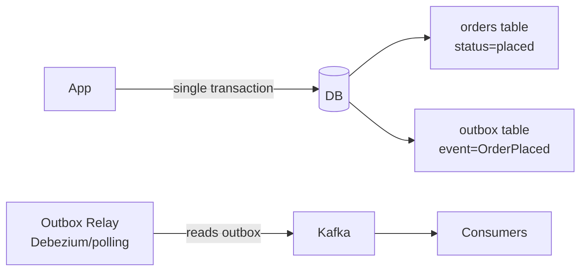
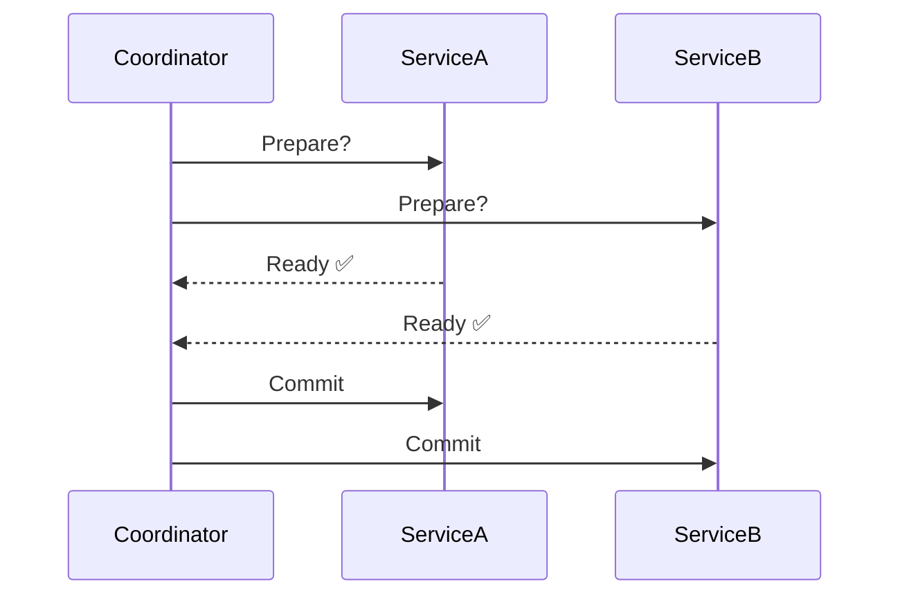

# Multi-step Processes

## What is it?
Patterns for coordinating workflows that span multiple services or steps — where each step can fail independently. The core challenge: how do you maintain consistency without a single distributed transaction?

---

## The Problem
In a monolith you can wrap everything in one DB transaction. In microservices, you can't:

```
Place Order workflow:
  1. Charge payment      (Payment Service)
  2. Reserve inventory   (Inventory Service)
  3. Schedule delivery   (Delivery Service)
  4. Send confirmation   (Notification Service)

What if step 3 fails after steps 1 and 2 succeeded?
```

---

## Solution 1: Saga Pattern
Break the workflow into a sequence of local transactions. Each step publishes an event. If a step fails, run **compensating transactions** to undo previous steps.

### Choreography-based Saga
Services react to events — no central coordinator.



- ✅ Loosely coupled — services don't know about each other
- ❌ Hard to track overall workflow state
- ❌ Complex failure paths — compensations can also fail
- **Use when:** simple linear workflows with few steps

---

### Orchestration-based Saga
A central **orchestrator** tells each service what to do and handles failures.



- ✅ Clear visibility into workflow state
- ✅ Easier to reason about failure handling
- ❌ Orchestrator can become a bottleneck or SPOF
- **Use when:** complex workflows, multiple failure paths, need audit trail

---

## Solution 2: Outbox Pattern
Guarantees that a DB write and an event publish happen atomically — without a distributed transaction.



- App writes to both `orders` table and `outbox` table **in one local transaction**
- A relay process reads the outbox and publishes to Kafka
- ✅ Atomic — if DB write fails, event is never published
- ✅ If relay crashes, it replays from outbox
- ❌ Slight delay between DB write and event publish
- **Use when:** you need guaranteed event publishing without dual-write risk

---

## Solution 3: Two-Phase Commit (2PC)
A coordinator asks all participants to **prepare**, then tells them all to **commit** or **rollback**.



- ✅ Strong consistency — all or nothing
- ❌ Blocking — if coordinator crashes after prepare, participants are stuck
- ❌ Doesn't scale in microservices
- **Use when:** rarely — legacy systems, same-DB multi-table transactions only

---

## Solution 4: Process Manager / State Machine
Model the workflow explicitly as a state machine. Persist state at every step.

```
Order states:
PENDING → PAYMENT_CHARGED → STOCK_RESERVED → DELIVERY_SCHEDULED → COMPLETE
                                           ↓ (on failure)
                                     STOCK_RELEASED → PAYMENT_REFUNDED → CANCELLED
```

- Each transition is persisted to DB — survives crashes
- Worker picks up where it left off on restart
- ✅ Resumable, auditable
- **Use when:** long-running workflows (hours/days), need full audit trail

---

## Idempotency — The Critical Companion Pattern
Every step in a multi-step process must be **idempotent** — safe to retry without side effects.

```
POST /payments/charge
Body: { orderId: "ord_42", idempotencyKey: "ord_42_charge_v1" }

If this request is retried:
→ Payment service checks if idempotencyKey already processed
→ Returns same result without charging again
```

- Store idempotency keys in DB with the result
- TTL them after 24–48 hours
- ✅ Makes retries safe — essential for at-least-once delivery systems

---

## Failure Modes & Mitigations

| Failure | Impact | Mitigation |
|---|---|---|
| **Step fails mid-saga** | Partial completion — inconsistent state | Compensating transactions; ensure all steps are idempotent |
| **Compensating transaction fails** | Stuck in inconsistent state | Retry with backoff; dead letter queue for manual intervention |
| **Orchestrator crashes** | Workflow stuck mid-flight | Persist orchestrator state to DB; resume on restart |
| **Outbox relay crashes** | Events delayed but not lost | Relay replays from last processed outbox row on restart |
| **Duplicate event delivery** | Step executed twice | Idempotency keys on every step |

---

## Interview Talking Points
- Saga over 2PC in microservices — 2PC doesn't scale and blocks on coordinator failure
- **Choreography vs Orchestration** trade-off — coupling vs visibility
- Always pair Saga with **idempotency keys** — interviewers love this
- **Outbox pattern** solves the dual-write problem — mention it when asked about reliable event publishing
- State machine / process manager for long-running workflows — shows maturity
