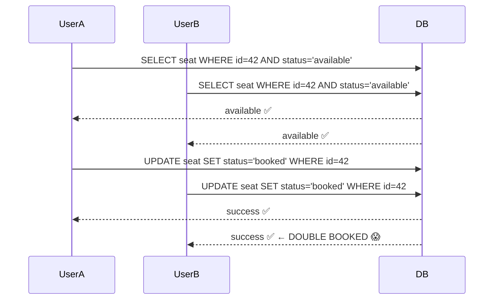
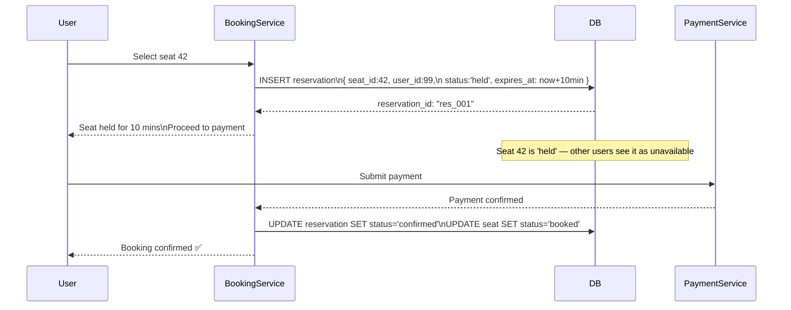
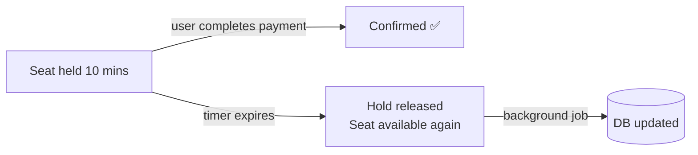
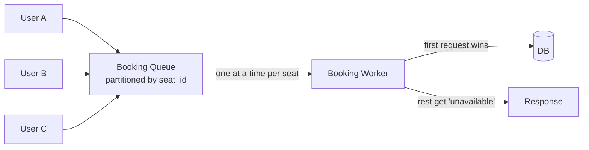

# Preventing Double Booking

## What is it?
Ensuring that a finite resource (seat, hotel room, order inventory) is never confirmed to more than one party simultaneously. The core challenge: multiple users attempting to book the same resource at the exact same time.

---

## The Problem



---

## Solution 1: Pessimistic Locking (SELECT FOR UPDATE)
Lock the row at read time. No other transaction can read or write until lock is released.

```mermaid
sequenceDiagram
    participant UserA
    participant UserB
    participant DB

    UserA->>DB: BEGIN;\nSELECT * FROM seats WHERE id=42 FOR UPDATE
    Note over DB: Row 42 locked 🔒
    UserB->>DB: SELECT * FROM seats WHERE id=42 FOR UPDATE
    Note over UserB: Blocked — waiting for lock

    UserA->>DB: UPDATE seats SET status='booked' WHERE id=42
    UserA->>DB: COMMIT; (lock released)

    Note over UserB: Lock released — unblocked
    DB-->>UserB: seat already booked ← returns booked status
    UserB->>UserB: Show "seat unavailable"
```

```sql
BEGIN;
SELECT * FROM seats WHERE id = 42 AND status = 'available' FOR UPDATE;
-- If available:
UPDATE seats SET status = 'booked', user_id = 99 WHERE id = 42;
COMMIT;
```

- ✅ Guaranteed no double booking
- ✅ Simple to implement
- ❌ Blocks concurrent users — lower throughput under high contention
- ❌ Risk of deadlock if multiple rows locked in different orders
- **Use when:** low-to-medium contention (hotel rooms, appointment slots)

---

## Solution 2: Optimistic Locking (Version Check)
No lock on read. At write time, verify nothing changed using a version number.

```sql
-- Read with version
SELECT id, status, version FROM seats WHERE id = 42;
-- Returns: status='available', version=5

-- Write only if version unchanged
UPDATE seats
SET status = 'booked', user_id = 99, version = 6
WHERE id = 42 AND version = 5 AND status = 'available';

-- Check affected rows:
-- 1 row updated → success ✅
-- 0 rows updated → someone else booked it → show error ❌
```

- ✅ No blocking — high throughput
- ❌ Losing users must retry or get an error
- **Use when:** low contention, most users won't collide (e.g. different seats)

---

## Solution 3: Two-Phase Hold + Confirm (Reservation Pattern)
The most robust pattern for booking systems. Separate the **hold** from the **confirm**.



### Hold Expiry — What if user abandons checkout?


- Background job (cron or scheduler) scans for expired holds and releases them
- Or use DB TTL / Redis expiry to auto-release

```sql
-- Release expired holds
UPDATE reservations
SET status = 'expired'
WHERE status = 'held' AND expires_at < NOW();

UPDATE seats SET status = 'available'
WHERE id IN (
    SELECT seat_id FROM reservations WHERE status = 'expired'
);
```

- ✅ User has guaranteed window to complete payment
- ✅ No double booking possible during hold
- ✅ Handles abandoned checkouts automatically
- ❌ Reduces available inventory during hold window
- **Use when:** ticketing (Ticketmaster), hotel booking, airline seats, restaurant reservations

---

## Solution 4: Atomic DB Operations + Unique Constraints
Let the database enforce uniqueness at the schema level.

```sql
-- Schema constraint
CREATE UNIQUE INDEX idx_seat_booked
ON bookings(seat_id)
WHERE status IN ('held', 'confirmed');

-- Attempt booking
INSERT INTO bookings (seat_id, user_id, status)
VALUES (42, 99, 'confirmed');

-- If seat already booked:
-- ERROR: duplicate key value violates unique constraint ← handle in app
```

- ✅ Database enforces correctness — bulletproof
- ✅ No application-level locking needed
- ❌ Must handle constraint violation errors gracefully in app code
- **Use when:** simple inventory systems, order line items

---

## Solution 5: Queue-Based Serialization
Funnel all booking requests for a resource through a single queue — process one at a time.



- Partition queue by resource ID — seat 42 requests go to same partition
- ✅ Zero contention — serialized per resource
- ✅ Handles massive traffic spikes
- ❌ Adds latency
- **Use when:** flash sales, high-demand event ticket releases (thousands of users hitting same seat)

---

## Idempotency — Preventing Duplicate Confirmations
Network retries can cause the same booking to be submitted twice. Always use idempotency keys.

```python
POST /bookings
Headers:
  Idempotency-Key: "user_99_seat_42_attempt_1"
Body:
  { seat_id: 42, payment_token: "tok_xyz" }

# If retried with same key:
# → Return original response without double-charging or double-booking
```

```sql
-- Store idempotency key with result
CREATE TABLE idempotency_keys (
    key         VARCHAR PRIMARY KEY,
    response    JSONB,
    created_at  TIMESTAMP DEFAULT NOW()
);

-- On every booking request:
-- 1. Check if key exists → return cached response
-- 2. If not → process booking → store key + response
```

---

## Decision Guide

| Scenario | Best Approach |
|---|---|
| Low traffic, simple booking | Pessimistic locking |
| High traffic, mostly different resources | Optimistic locking |
| Multi-step checkout (select → pay) | Two-phase hold + confirm |
| Schema-level guarantee needed | Unique constraint |
| Flash sale / high-demand release | Queue-based serialization |
| All scenarios | + Idempotency keys always |

---

## Real-World Examples

| System | Pattern Used |
|---|---|
| **Ticketmaster** | Hold + confirm with short TTL (e.g. 8 min checkout window) |
| **Airbnb / Hotels.com** | Hold + confirm; optimistic locking for calendar blocks |
| **Amazon orders** | Atomic inventory decrement + unique constraint |
| **Flash sales (Shopify)** | Queue serialization + Redis atomic DECR |
| **Restaurant reservations** | Hold + confirm with longer TTL (e.g. 15 min) |

---

## Failure Modes & Mitigations

| Failure | Impact | Mitigation |
|---|---|---|
| **Hold never expires** | Inventory permanently locked | Background job to expire holds; set DB-level TTL as safety net |
| **Payment succeeds but confirmation fails** | User charged but no booking | Idempotency key + saga compensating transaction (refund) |
| **Queue worker crashes mid-booking** | Booking lost or stuck | Persist job state; at-least-once delivery + idempotency check |
| **Deadlock on pessimistic lock** | Transactions block each other | Always acquire locks in consistent order; set lock timeout |
| **Optimistic lock starvation** | High-demand seat causes infinite retries | Fall back to queue serialization for high-contention resources |

---

## Interview Talking Points
- Lead with the **two-phase hold + confirm** pattern — it's what real booking systems use
- Always mention **hold expiry** — what happens when users abandon checkout is a common follow-up
- **Idempotency keys** on every booking endpoint — network retries are inevitable
- For flash sales specifically → **queue serialization** is the right answer
- Unique constraints as a **last line of defense** — even if application logic has a bug, DB won't double-book
- Combine patterns: hold + confirm + unique constraint + idempotency = production-grade
