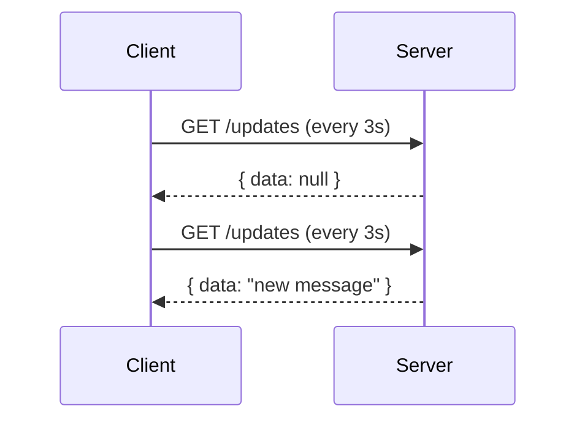
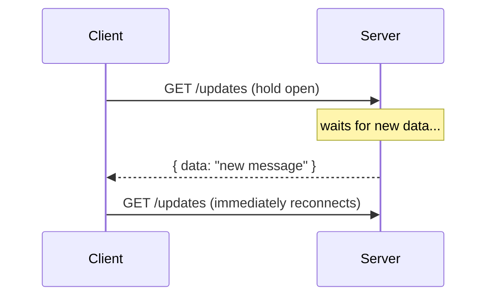
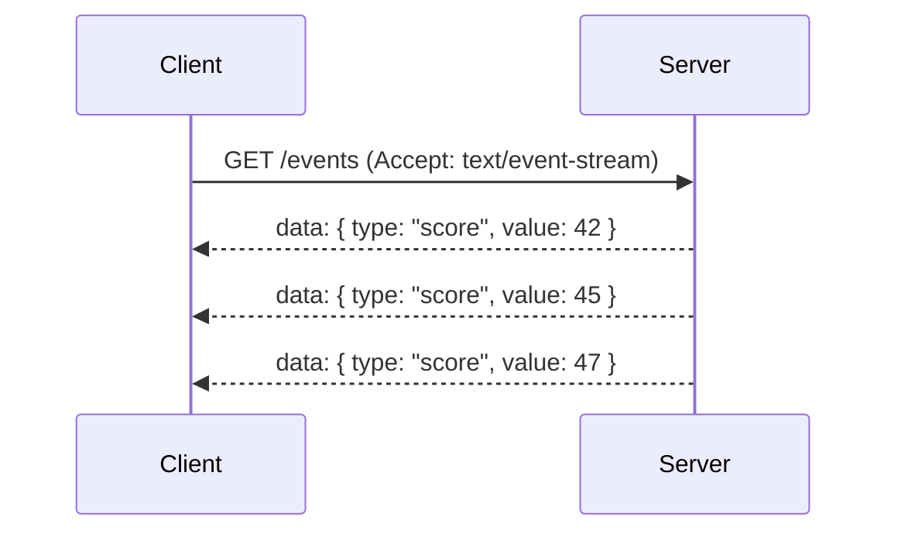
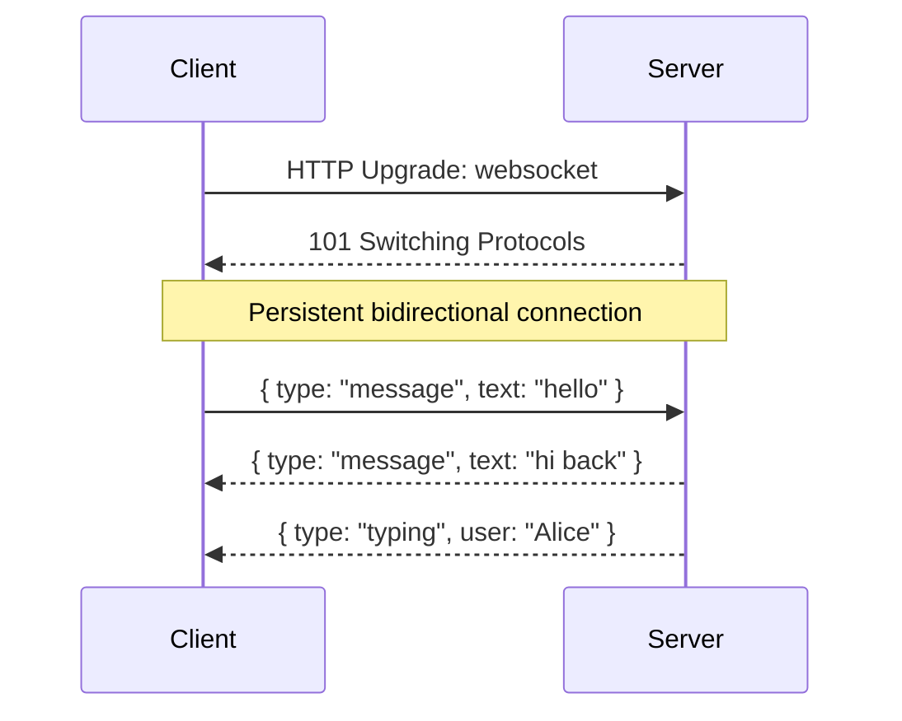
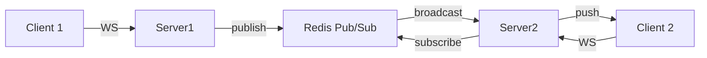

# Real-time Updates

## What is it?
Patterns for pushing live data from server to client without the client having to repeatedly ask. Core to chat apps, live feeds, notifications, dashboards, and collaborative tools.

---

## The 4 Approaches

### 1. Short Polling
Client repeatedly asks the server on a fixed interval.

- ✅ Simple to implement
- ❌ Wasteful — most responses are empty
- ❌ Latency = polling interval
- **Use when:** simplicity matters and real-time isn't critical

---

### 2. Long Polling
Client asks, server holds the connection open until data is available.

- ✅ Lower latency than short polling
- ✅ Works everywhere HTTP works
- ❌ Server holds many open connections — resource intensive
- **Use when:** WebSockets aren't available (firewalls, proxies)

---

### 3. Server-Sent Events (SSE)
Server pushes a stream of events over a single persistent HTTP connection. One direction only (server → client).

- ✅ Simple — built on HTTP, no special protocol
- ✅ Auto-reconnects on disconnect
- ✅ Works through proxies/firewalls
- ❌ One-directional only
- ❌ Limited to ~6 concurrent connections per browser (HTTP/1.1)
- **Use when:** server → client only (live scores, notifications, log streaming, AI token streaming)

---

### 4. WebSockets
Full-duplex persistent TCP connection. Both sides can send at any time.

- ✅ Full duplex — both sides send freely
- ✅ Low latency (no HTTP overhead per message)
- ❌ Stateful — harder to scale horizontally (connection pinned to a server)
- ❌ Needs L4 load balancer (not L7) or sticky sessions
- **Use when:** chat, multiplayer games, collaborative editing, trading platforms

---

## Comparison

| | Short Poll | Long Poll | SSE | WebSocket |
|---|---|---|---|---|
| Direction | Client→Server | Client→Server | Server→Client | Both |
| Protocol | HTTP | HTTP | HTTP | WS |
| Latency | High | Medium | Low | Very Low |
| Complexity | Low | Medium | Low | High |
| Scales easily | ✅ | ⚠️ | ✅ | ❌ (stateful) |

---

## Scaling WebSockets
Since each WebSocket is a persistent connection pinned to a server, horizontal scaling needs a **pub/sub backplane**:

- Server 1 receives a message from Client 1
- Publishes to Redis pub/sub channel
- Server 2 (where Client 2 is connected) receives it and pushes to Client 2
- **Redis pub/sub or Kafka** are the standard backplanes

---

## Failure Modes & Mitigations

| Failure | Impact | Mitigation |
|---|---|---|
| **WebSocket server crashes** | All connections on that server dropped | Client auto-reconnects with exponential backoff; re-subscribe to channels on reconnect |
| **Message lost during disconnect** | Client misses updates | Use sequence numbers or timestamps; client requests missed events on reconnect |
| **Redis pub/sub backplane down** | Messages not broadcast across servers | Redis Sentinel for HA; fall back to SSE or polling temporarily |
| **Too many open connections** | Server OOM | Use a dedicated WS gateway (Socket.io, Pusher, Ably); horizontal scale with backplane |

---

## Interview Talking Points
- SSE for **server → client only** (notifications, feeds) — simpler than WebSockets
- WebSockets for **bidirectional** (chat, games) — but flag the statefulness problem
- Always mention the **Redis pub/sub backplane** for scaling WebSockets horizontally
- L4 load balancer needed for WebSockets (we covered this in the load balancer doc)
- For AI streaming responses (like ChatGPT) → SSE is the standard choice
