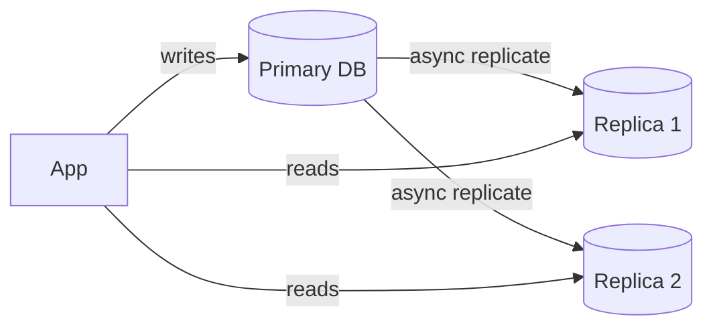
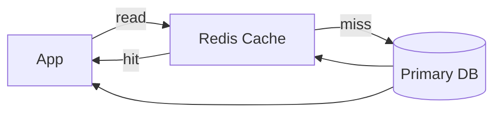
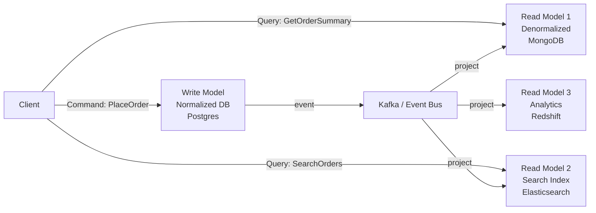
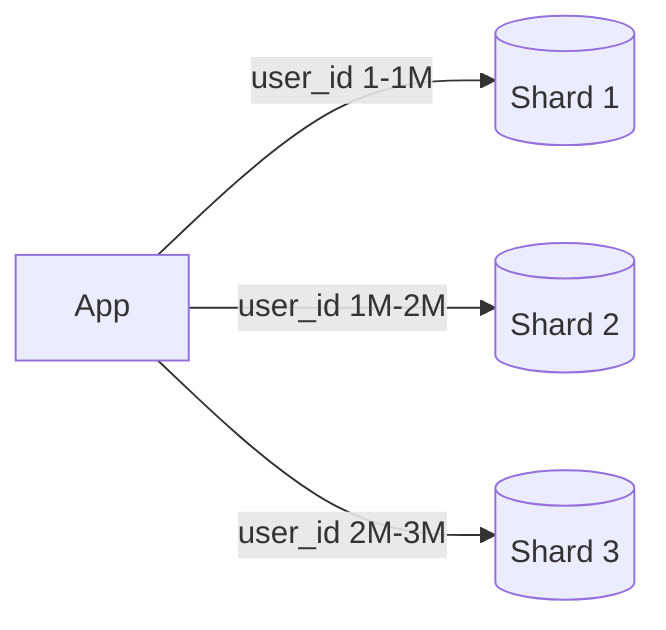
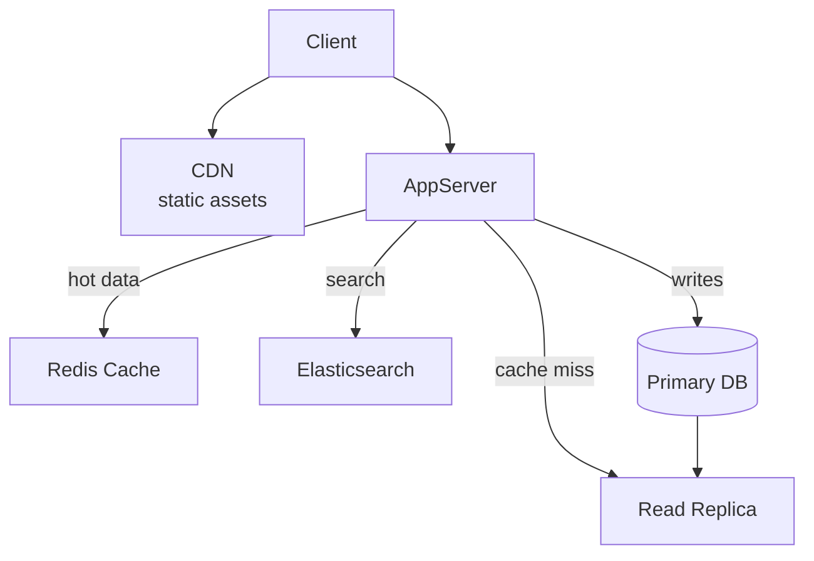

# Scaling Reads

## What is it?
Patterns for handling high read throughput without overwhelming your primary database. Most applications are read-heavy (10:1 to 100:1 read/write ratio), so scaling reads is often the first bottleneck you hit.

---

## Pattern 1: Read Replicas
Add read-only copies of your primary DB. Route read queries to replicas.



- ✅ Simple — most managed DBs support this out of the box
- ✅ Replicas can be in different regions (geo reads)
- ❌ Replication lag — reads may be slightly stale
- ❌ Still limited by single primary for writes
- **Use when:** read-heavy workload, acceptable eventual consistency for reads

---

## Pattern 2: Caching Layer
Serve reads from in-memory cache (Redis) — skip the DB entirely for hot data.



- ✅ Orders of magnitude faster than DB reads
- ✅ Dramatically reduces DB load
- ❌ Cache invalidation complexity (see caching doc)
- ❌ Not suitable for data that changes frequently
- **Use when:** hot data, repeated reads of same data (product pages, user profiles)

---

## Pattern 3: CQRS (Command Query Responsibility Segregation)
Separate the **write model** (commands) from the **read model** (queries). Each is optimized independently.



- Write model is normalized, consistent
- Read models are **denormalized and purpose-built** for each query type
- ✅ Each read model can be a different technology optimized for its query
- ✅ Read and write sides scale independently
- ❌ Eventual consistency between write and read models
- ❌ Operational complexity — multiple data stores to manage
- **Use when:** complex read requirements, different query patterns need different data shapes

---

## Pattern 4: Denormalization
Store redundant data to avoid expensive joins at read time.

```
Normalized (needs join):          Denormalized (single read):
orders table                      orders table
  order_id                          order_id
  user_id  ──→ users table          user_name      ← copied from users
  product_id ──→ products table     product_name   ← copied from products
                                    product_price  ← copied from products
```

- ✅ Faster reads — no joins
- ❌ Data duplication — updates must touch multiple places
- **Use when:** read performance is critical and data changes infrequently

---

## Pattern 5: Database Sharding for Reads
Split data across multiple DB instances — each shard handles reads for its subset of data.



- ✅ Scales both reads and writes
- ❌ Cross-shard queries are expensive
- ❌ Rebalancing shards is complex
- **Use when:** data volume exceeds single-node capacity

---

## Combining Patterns (Typical Production Stack)



Most production systems layer all of these together.

---

## Read Scaling Decision Guide

| Problem | Solution |
|---|---|
| DB CPU high from reads | Read replicas |
| Same data read repeatedly | Caching (Redis) |
| Complex queries slow | Denormalize or CQRS read model |
| Different query shapes needed | CQRS with purpose-built read models |
| Data volume too large | Sharding |
| Full-text search slow | Offload to Elasticsearch |

---

## Failure Modes & Mitigations

| Failure | Impact | Mitigation |
|---|---|---|
| **Replica lag too high** | Stale reads mislead users | Monitor replication lag; route consistency-critical reads to primary |
| **Cache stampede** | DB overwhelmed on cache miss | TTL jitter + mutex lock (covered in caching doc) |
| **CQRS read model out of sync** | Stale read model served | Read models are eventually consistent by design; show last-updated timestamp to users |
| **Shard hotspot** | One shard overwhelmed | Choose high-cardinality shard key; add read replicas per shard |

---

## Interview Talking Points
- Start simple: **replica + cache** covers most cases
- CQRS is powerful but adds complexity — only introduce when different query patterns genuinely need different data shapes
- Denormalization is a **deliberate trade-off** — fast reads at the cost of write complexity
- Always mention **replication lag** when discussing replicas — shows you know the consistency trade-off
- In practice these patterns are **layered** — CDN → cache → replica → primary
