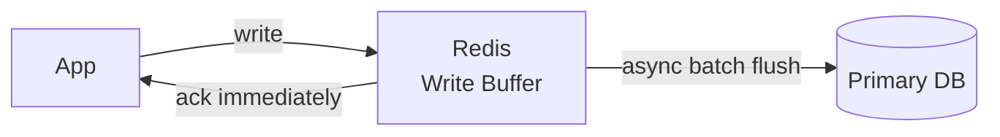
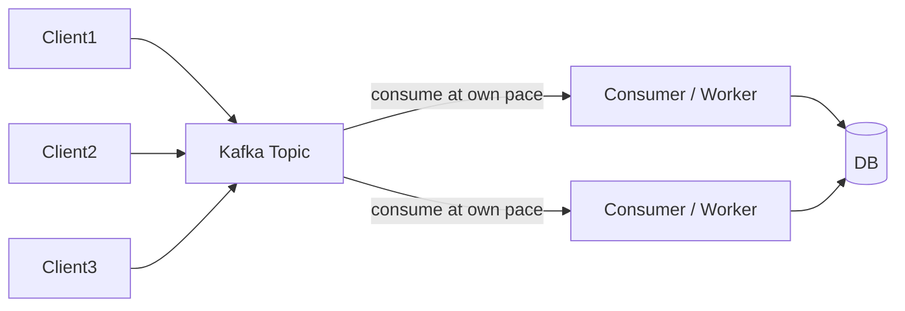
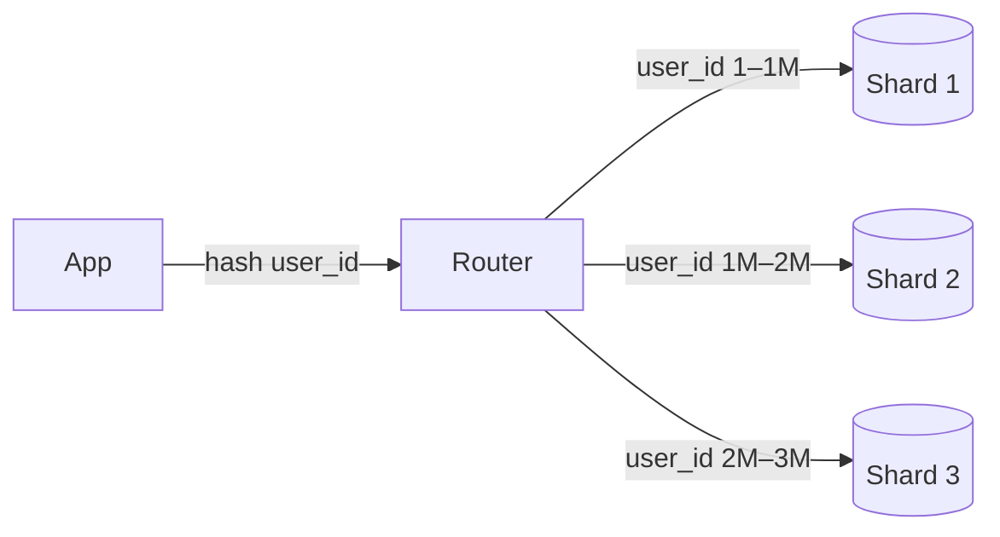
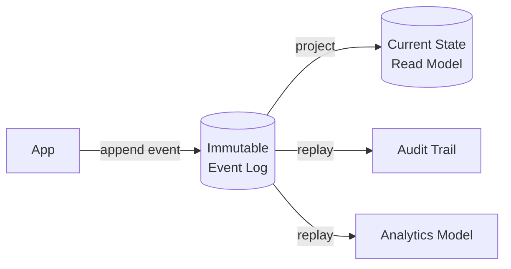

# Scaling Writes

## What is it?
Patterns for handling high write throughput beyond what a single primary DB can handle. Writes are harder to scale than reads because you can't just add replicas — you need to distribute the write load itself.

---

## Pattern 1: Write-Behind Caching (Buffer Writes)
Absorb writes into a fast cache layer first, flush to DB asynchronously.



- ✅ Dramatically reduces DB write pressure
- ✅ Batching = fewer, larger writes = efficient
- ❌ Data loss risk if Redis crashes before flush
- **Use when:** counters, analytics events, non-critical high-frequency writes (view counts, likes)

---

## Pattern 2: Message Queue as Write Buffer
Producers write to a queue (Kafka/SQS). Consumers process at their own pace.



- ✅ Decouples producers from consumers — handles traffic spikes
- ✅ Durable — messages survive consumer crashes
- ✅ Multiple consumers = parallel processing
- ❌ Adds latency — writes aren't immediately in DB
- **Use when:** event ingestion, order processing, audit logs, any write that can be async

---

## Pattern 3: Database Sharding
Split the dataset across multiple DB instances — each shard handles writes for its partition.



### Sharding Strategies

| Strategy | How | Pro | Con |
|---|---|---|---|
| **Hash sharding** | hash(key) % N shards | Even distribution | Rebalancing hard when adding shards |
| **Range sharding** | key ranges per shard | Easy range queries | Hot shards if data not evenly distributed |
| **Directory sharding** | Lookup table → shard | Flexible | Lookup table is SPOF |
| **Geo sharding** | Region → shard | Data locality | Uneven if regions differ in size |

- ✅ Scales writes linearly with shard count
- ❌ Cross-shard queries/transactions are complex
- ❌ Choosing the wrong shard key causes hot shards
- **Use when:** write volume exceeds single-node capacity

---

## Pattern 4: Event Sourcing
Instead of updating state in place, **append every change as an immutable event**.

```
Traditional:                    Event Sourcing:
UPDATE account                  INSERT event: { type: "Deposited", amount: 100 }
SET balance = 1100              INSERT event: { type: "Withdrawn", amount: 50 }
WHERE id = 42                   INSERT event: { type: "Deposited", amount: 200 }

Current state = replay all events → balance = 250
```



- ✅ Append-only = very fast writes (no locking, no updates)
- ✅ Full audit history built-in
- ✅ Rebuild any read model by replaying events
- ❌ Querying current state requires projection/snapshot
- ❌ Schema evolution of events is complex
- **Use when:** financial systems, audit-heavy domains, CQRS write side

---

## Pattern 5: Vertical Scaling + Connection Pooling
Before sharding — exhaust simpler options first.

- **Vertical scale:** bigger DB instance (more CPU, RAM, NVMe)
- **Connection pooling:** (PgBouncer for Postgres) — hundreds of app connections multiplexed into tens of DB connections
- ✅ Zero code changes
- ❌ Has a ceiling — eventually hits hardware limits

---

## Pattern 6: Time-Series Partitioning
For append-only time-series data (logs, metrics, events) — partition by time window.

```
Table: events_2024_01   (January data)
Table: events_2024_02   (February data)
Table: events_2024_03   (March data — current writes go here)
```

- Old partitions become read-only → queries skip them automatically
- ✅ Writes always go to current partition — no contention with old data
- ✅ Old partitions can be archived or dropped cheaply
- **Use when:** IoT data, logs, analytics events, anything time-ordered

---

## Write Scaling Decision Guide

| Problem | Solution |
|---|---|
| Write latency too high | Write-behind cache or async queue |
| Write volume exceeds single DB | Sharding |
| Need full audit history | Event sourcing |
| Traffic spikes overwhelming DB | Kafka queue as write buffer |
| Too many DB connections | PgBouncer connection pooling |
| High-volume time-ordered data | Time-series partitioning |

---

## Failure Modes & Mitigations

| Failure | Impact | Mitigation |
|---|---|---|
| **Write-behind cache crash** | Buffered writes lost | Persist write buffer to AOF; accept small loss for non-critical data |
| **Kafka consumer lag grows** | Writes pile up; processing falls behind | Scale consumers; monitor lag; add partitions for parallelism |
| **Hot shard** | One shard overwhelmed | Re-shard with better key; add read replicas to hot shard |
| **Event log grows unbounded** | Slow state reconstruction | Periodic snapshots — store current state at point-in-time; replay only from snapshot forward |

---

## Interview Talking Points
- Start with **connection pooling + vertical scaling** — don't jump to sharding prematurely
- Kafka as write buffer is the most common pattern for high-throughput writes — mention durability guarantee
- Sharding is powerful but **shard key choice is critical** — wrong key = hot shards
- Event sourcing pairs naturally with CQRS — write side appends events, read side projects state
- Append-only writes (event sourcing, time partitioning) are the fastest write pattern — no locking
