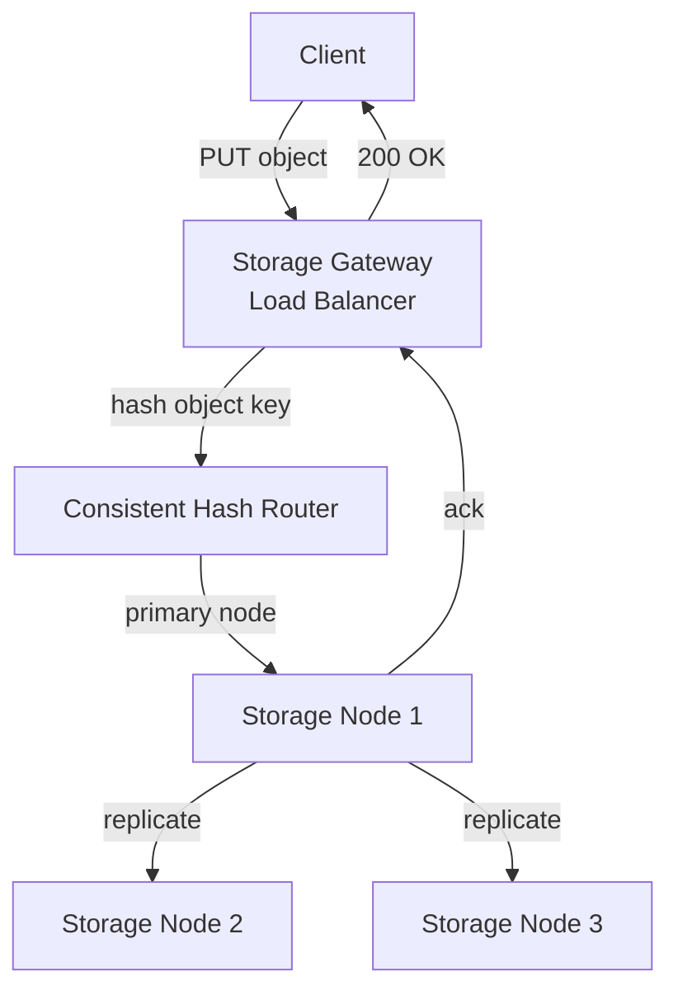
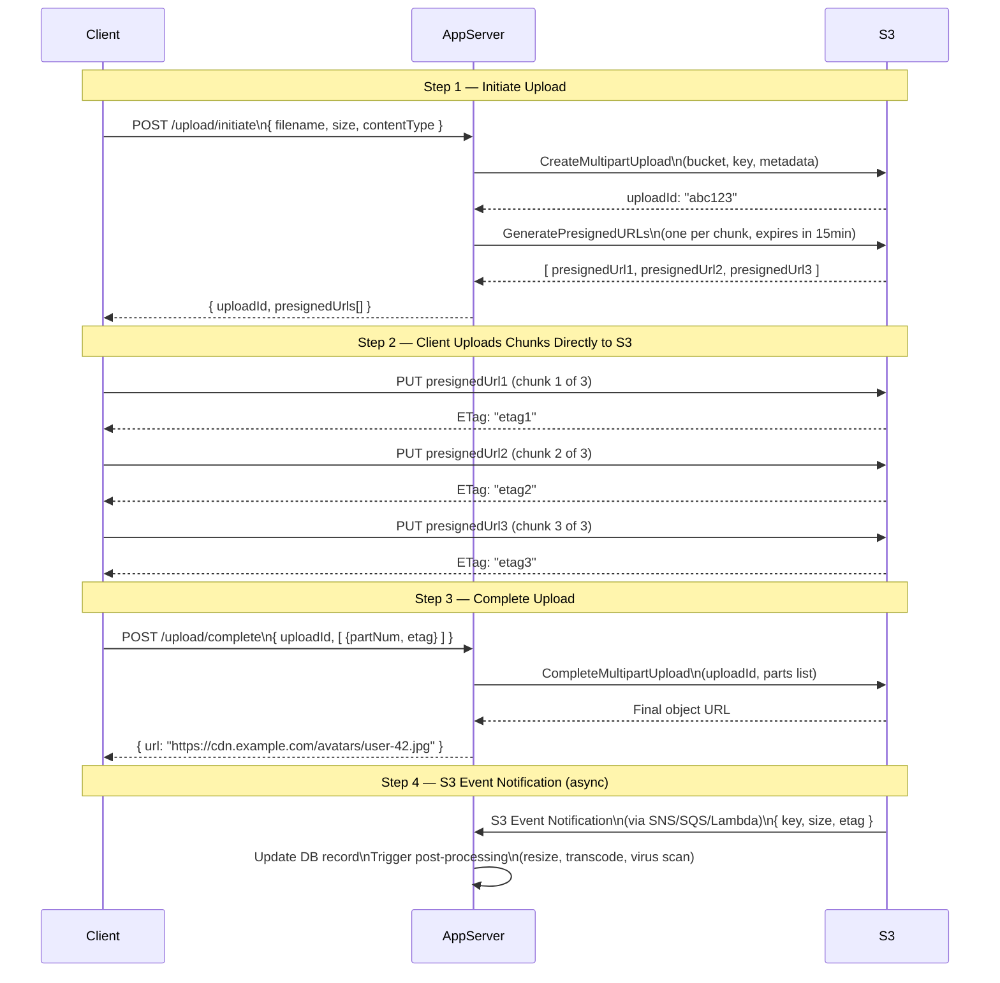
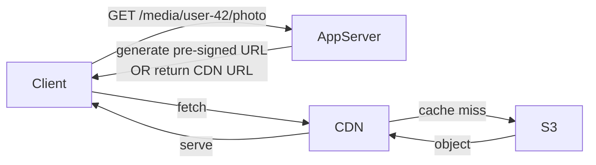
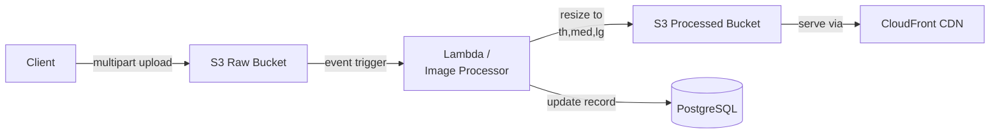

# Blob Storage

## What is it?
Object/Blob storage is a flat storage system for unstructured binary data — images, videos, audio, documents, backups. Unlike a file system, there is no hierarchy — just **buckets** containing **objects**, each addressable by a unique key.

---

## Key Concepts

| Concept | Description |
|---|---|
| **Bucket** | Top-level container (like a namespace) |
| **Object** | The stored file + its metadata |
| **Key** | Unique identifier for an object within a bucket (e.g. `avatars/user-42/profile.jpg`) |
| **Metadata** | Key-value pairs attached to an object (content-type, custom tags, etc.) |
| **Pre-signed URL** | A time-limited URL granting temporary access to upload or download without exposing credentials |

---

## Popular Blob Storage Services

| Service | Provider | Notes |
|---|---|---|
| **Amazon S3** | AWS | Industry standard; most features |
| **Google Cloud Storage** | GCP | Strong consistency by default |
| **Azure Blob Storage** | Azure | Tiered storage (hot/cool/archive) |
| **Cloudflare R2** | Cloudflare | S3-compatible; no egress fees |
| **MinIO** | Self-hosted | S3-compatible open source |

---

## How Blob Storage Works Internally

Objects are stored across a **distributed cluster** of storage nodes:



- Object key is **hashed** to determine which storage node owns it
- Data is **replicated** across multiple nodes (typically 3x) for durability
- S3 advertises **11 nines (99.999999999%)** of durability
- Storage is **eventually consistent** for overwrites/deletes (strong consistent reads in S3 since 2020)

---

## The Upload Flow — Pre-signed URL + Multipart Upload

This is the standard pattern used in production apps. The client never sends the file through your backend server — it uploads **directly to S3**. Your server only orchestrates.



### Why this pattern?
- ✅ Your server never touches the file bytes — **no bandwidth cost on your backend**
- ✅ Client uploads in **parallel chunks** — fast for large files
- ✅ **Resumable** — if a chunk fails, retry just that chunk (not the whole file)
- ✅ Pre-signed URLs are **time-limited and scoped** — no credentials exposed to client

---

## Chunk Size Guidelines

| File Size | Recommended Chunk Size | # of Chunks |
|---|---|---|
| < 5 MB | Single PUT (no multipart needed) | 1 |
| 5 MB – 100 MB | 5–10 MB chunks | 10–20 |
| 100 MB – 1 GB | 10–25 MB chunks | 10–40 |
| > 1 GB | 25–50 MB chunks | varies |

> S3 minimum part size is **5 MB** (except the last part). Maximum **10,000 parts** per upload.

---

## Download Flow — Pre-signed URL or CDN



- For **private files** — generate a pre-signed GET URL (time-limited)
- For **public files** — put CloudFront/CDN in front of S3; never expose S3 directly
- CDN caches the object at the edge — subsequent users get it from CDN, not S3

---

## Storage Classes (Cost Optimization)

| Class | Access Pattern | Retrieval | Cost |
|---|---|---|---|
| **Standard** | Frequent access | Instant | $$$ |
| **Infrequent Access (IA)** | Monthly | Instant | $$ |
| **Glacier Instant** | Quarterly | Instant | $ |
| **Glacier Deep Archive** | Yearly | 12 hrs | ¢ |

Use **S3 Lifecycle Policies** to automatically move objects between tiers:
```
Upload → Standard (30 days) → IA (90 days) → Glacier (1 year) → Delete
```

---

## Common Patterns in System Design

### Pattern 1: Image Upload Pipeline


### Pattern 2: Video Transcoding
```
Upload raw video → S3 → trigger → AWS MediaConvert / FFmpeg service
→ transcode to 360p/720p/1080p → store outputs in S3 → serve via CDN
```

### Pattern 3: Backup Storage
```
App DB → nightly dump → compress → encrypt → S3 Glacier
```

---

## Security Considerations
- **Never make buckets public** by default — use pre-signed URLs for access control
- Enable **bucket versioning** — protects against accidental deletes/overwrites
- Enable **server-side encryption** (SSE-S3 or SSE-KMS) — data encrypted at rest
- Use **IAM roles** not access keys for server-to-S3 auth
- Set **CORS policy** on bucket to allow only your domain to upload

---

## Interview Talking Points
- Pre-signed URL pattern — client uploads **directly to S3**, server just orchestrates — mention this proactively
- Multipart upload = **parallel chunks + resumability** — critical for large files
- Always put a **CDN in front of S3** for reads — never serve S3 directly to users
- S3 event notifications → Lambda/SQS for **async post-processing** (resize, transcode, scan)
- Mention **lifecycle policies** for cost optimization — shows operational maturity
- For private files — pre-signed GET URL with short TTL (15 min)
- Blob storage is **eventually consistent for deletes** — worth flagging in consistency-sensitive designs
